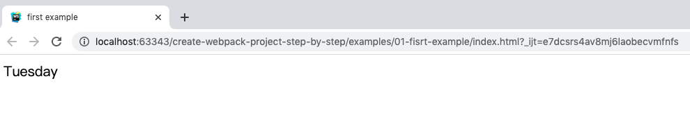

# 手把手教你创建一个 webpack 工程

[01]: https://webpack.js.org/guides/
[02]: https://www.webpackjs.com/guides/
[11]: http://momentjs.cn/
[21]: https://docs.npmjs.com/creating-a-package-json-file 

## 前言
我发现有很多前端同学在**快速**实现产品经理**验证性**需求的时候，往往会采用简单的页面。

简单的html页面确实可以快速搭建出一个demo出来。但是随着迭代的推进，越来越多的功能堆砌在了这个页面上面，最后难以扩展、难以维护。

> 开发人员一定要有远见！无论什么项目都应使用一个易扩展、易维护的架构。
>
> 以免给自己挖坑，到头来还得重构。

因此，希望前端同学能够通过这个文档学会：

- 一个基本的webpack工程（开发与生成分离）
- 添加 babel
- 添加 eslint
- 添加 prettier
- 添加 postcss
- 添加 stylelint
- 备选 sass

> **架构未必最优！如有好的建议，欢迎指出~**

## 目录：
  1. [一个简单的webpack工程](#t01)
  2. [使用webpack构建项目](#t02)
  
前面几个例子是根据 [webpack官方文档][01]编写的。

大家也可以自己阅读 [官方文档][01] 进行自学，当然也可以看 [中文文档][02] 

> **注意**：中文文档更新不够及时。如果中文文档中的示例不好使，可以查看[官方文档][01]。

## <a id="t01">1.一个生产与开发分离的webpack工程</a>
这个工程是根据 [官方文档][01] 中的示例搭建的，只是额外引用了几个`plugin`。

如果有诸多不清楚的地方，强烈建议先学习一下 [官方文档][01]，也可以看一下[中文文档][02] 。里面的教程非常棒！！！
> **注意**：中文文档更新不及时。如果中文文档中的示例不好使，可以查看[官方文档][01]。

例子：[01-base](./examples/01-base)

### package.json

在`package.json`中，注册了两个 `script`，以便于快速调用开发与生产的命令。

```
"scripts": {
  "dev": "webpack-dev-server --config build/webpack.dev.js",
  "build": "webpack --config build/webpack.prod.js"
}
```

同时，引用一些常用的`plugin`：

[clean-webpack-plugin](https://www.npmjs.com/package/clean-webpack-plugin): 清除 dist 文件夹 \
[compression-webpack-plugin](https://www.npmjs.com/package/compression-webpack-plugin): 生成 gzip 文件 \
[html-webpack-plugin](https://www.npmjs.com/package/html-webpack-plugin): 生成 html5，并以script标签的形式引入打包后的 `bundle.js` 文件。 \
[mini-css-extract-plugin](https://www.npmjs.com/package/mini-css-extract-plugin): 抽取css文件 \
[webpack-bundle-analyzer](https://www.npmjs.com/package/webpack-bundle-analyzer): 分析打包出来的文件 \
[webpack-merge](https://www.npmjs.com/package/webpack-merge): 合并数组和对象，但不是覆盖！！！ 

[package.json](./examples/01-base/package.json)

```json
{
  "name": "01-base",
  "version": "1.0.0",
  "description": "",
  "main": "index.js",
  "scripts": {
    "dev": "webpack-dev-server --config build/webpack.dev.js",
    "build": "webpack --config build/webpack.prod.js"
  },
  "keywords": [],
  "author": "",
  "license": "ISC",
  "dependencies": {
    "clean-webpack-plugin": "^3.0.0",
    "compression-webpack-plugin": "^5.0.1",
    "css-loader": "^4.2.2",
    "html-webpack-plugin": "^4.3.0",
    "mini-css-extract-plugin": "^0.10.0",
    "style-loader": "^1.2.1",
    "webpack": "^4.44.1",
    "webpack-bundle-analyzer": "^3.8.0",
    "webpack-cli": "^3.3.12",
    "webpack-dev-server": "^3.11.0",
    "webpack-merge": "^5.1.2"
  }
}
```

#### 配置

开发环境和生产环境的构建目标差异很大。在开发环境中，我们需要强大的**热更新**功能，及localhost server。而在生产环境中，我们的目标则转向于关注更小的bundle，更轻量级的source map，及优化资源，以改善加载时间。

因此我们需要根据不同环境使用不同的**webpack配置**。

> 本例是参考了 [官方的例子](https://webpack.js.org/guides/production/)，并做了一点调整。 [中文文档](https://www.webpackjs.com/guides/production/) 中的例子有点老，不适用于 webpack 4+。

[build/webpack.base.js](./examples/01-base/build/webpack.base.js):

```javascript
const path = require('path')

module.exports = {
  entry: {
    app: './src/index.js'
  },
  output: {
    filename: '[name].[hash].js',
    path: path.resolve(__dirname, '../dist')
  },
  module: {
    rules: [
      {
        test: /\.css$/,
        use: ['style-loader', 'css-loader']
      }
    ]
  }
}

```

> **注意**: output.filename 不能使用 [chunkhash]，只能使用 [hash]，否则在 **开发模式(dev)** 下会报错。

[build/webpack.dev.js](./examples/01-base/build/webpack.dev.js)

```javascript
// 合并数组和对象，但不是覆盖！！！
// https://www.npmjs.com/package/webpack-merge
const { merge } = require('webpack-merge')

// 生成 html5，并在body中使用script标签引入打包后的js文件。
// https://www.npmjs.com/package/html-webpack-plugin
const HtmlWebpackPlugin = require('html-webpack-plugin')

const base = require('./webpack.base')

module.exports = merge(base, {
  mode: 'development', // 声明开发模式
  devServer: {
    contentBase: '../dist',
    hot: true, // 热模块更新 - 局部更新
    host: '0.0.0.0', // 设置后，其他机器可以通过ip访问
    port: '8080' // 端口
  },
  // 'cheap-module-eval-source-map'低开销的source-map，但只映射行数。
  // 'eval-source-map'，初始化source map的时候比较慢，但是重新构建时，提供比较快的速度，并能正确映射出报错的位置
  // https://www.webpackjs.com/configuration/devtool/
  devtool: 'cheap-module-eval-source-map',
  plugins: [
    new HtmlWebpackPlugin({
      filename: 'index.html', // 生成的文件名
      template: 'index.html', // 使用的模板文件
      inject: true, // 生成的script插到body底部
    })
  ]
})
```

[build/webpack.prod.js](./examples/01-base/build/webpack.prod.js)

```javascript
const path = require('path')
// 合并数组和对象，但不是覆盖！！！
// https://www.npmjs.com/package/webpack-merge
const { merge } = require('webpack-merge') // 合并数组和对象，但不是覆盖！！！

// 生成 gzip 文件
// https://www.npmjs.com/package/compression-webpack-plugin
const CompressionPlugin = require('compression-webpack-plugin')

// 分析打包出来的文件
// https://www.npmjs.com/package/webpack-bundle-analyzer
const BundleAnalyzerPlugin = require('webpack-bundle-analyzer').BundleAnalyzerPlugin

// 抽取css文件
// https://www.npmjs.com/package/mini-css-extract-plugin
const MiniCssExtractPlugin = require('mini-css-extract-plugin')

// 生成 html5，并在body中使用script标签引入打包后的js文件。
// https://www.npmjs.com/package/html-webpack-plugin
const HtmlWebpackPlugin = require('html-webpack-plugin')

// 清理 dist 文件夹
const { CleanWebpackPlugin } = require('clean-webpack-plugin')

const base = require('./webpack.base')
const config = {
  bundleAnalyzerReport: false,
  productionGzip: true,
}

const webpackConfig = merge(base, {
  mode: 'production',
  output: {
    filename: '[name].[chunkhash].js',
    path: path.resolve(__dirname, '../dist')
  },
  // source-map: 整个source map 作为独立文件生成，并未bundle添加一个引用注释。
  // https://www.webpackjs.com/configuration/devtool/
  devtool: 'source-map',
  optimization: {
    splitChunks: { chunks: 'all' }
  },
  module: {
    rules: [
      {
        test: /\.css$/i,
        use: [{
          loader: MiniCssExtractPlugin.loader,
          options: {
            esModule: true,
          },
        }, 'css-loader']
      }
    ]
  },
  plugins: [
    new CleanWebpackPlugin(),
    new MiniCssExtractPlugin(),
    new HtmlWebpackPlugin({
      filename: 'index.html',
      template: 'index.html',
      minify: {
        removeComments: true, // 移除html中的注释
        collapseWhitespace: true, // 去掉留白部分
        removeAttributeQuotes: true // 去掉属性中的引号
      },
      inject: true
    })
  ]
})

// 生成 gzip 文件
// https://www.npmjs.com/package/compression-webpack-plugin
if (config.productionGzip) {
  const CompressionWebpackPlugin = require('compression-webpack-plugin')
  webpackConfig.plugins.push(
    new CompressionWebpackPlugin({
      test: new RegExp( //只打包 js和css 文件
        '\\.(js|css)$'
      ),
      threshold: 10240,
      minRatio: 0.8
    })
  )
}

// 分析打包出来的文件
// https://www.npmjs.com/package/webpack-bundle-analyzer
if (config.bundleAnalyzerReport) {
  const BundleAnalyzerPlugin = require('webpack-bundle-analyzer').BundleAnalyzerPlugin
  webpackConfig.plugins.push(new BundleAnalyzerPlugin())
}

module.exports = webpackConfig
```
在 `webpack.dev.js` 与 `webpack.prod.js` 中使用了功能强大的 `mode` 和 `devtool`。

##### mode

webpack 4+ 提供了 [mode](https://webpack.js.org/configuration/mode/) 配置选项，能够自动调用webpack的优化策略。

```
string = 'production': 'none' | 'development' | 'production'
```

在配置文件中

```javascript
module.exports = {
  mode: 'development' // 默认是 production
}
```

在开发模式下，会自动引用 NamedChunksPlugin 和 NameModulesPlugin。\
在生产模式下，会自动引用 FlagDependencyUsagePlugin、FlagIncludedChunksPlugin、ModuleConcatenationPlugin、NoEmitOnErrorsPlugin、OccurrenceOrderPlugin、SideEffectsFlagPlugin 及 TerserPlugin。

##### devtool

[devtool](https://www.webpackjs.com/configuration/devtool/) 选项控制是否生成，以及如何生成 [source map](https://blog.teamtreehouse.com/introduction-source-maps)。

在 `webpack.dev.js` 中，主要使用以下两种 source map：

- cheap-module-eval-source-map: 低开销的[source-map](https://blog.teamtreehouse.com/introduction-source-maps)，但只映射行数。（推荐）
- eval-source-map: 初始化source map的时候比较慢，但是重新构建时，提供比较快的速度，并能正确映射出报错的位置。

在 `webpack.prod.js` 中，主要使用以下三种 source map：

- source-map: 整个source map 作为独立文件生成，并为bundle添加一个引用注释。(推荐！需在**nginx**中设置访问.map文件的**ip白名单**，以保护代码安全。)
- hidden-source-map: hidden-source-map 与source-map 相同，但是不会为bundle添加引用注释。
- nosource-source-map: 创建的source map 不包括 源代码内容。只映射客户端上的堆栈信息，不会暴露所有源代码。

#### 其他配置

在 `webpack.dev.js` 中，添加了 [devServer](https://www.webpackjs.com/guides/development/#%E4%BD%BF%E7%94%A8-webpack-dev-server) 以便于开发过程中**模块热更新**。

在 `webpack.prod.js` 中，添加了 `optimization.slitChunks.chunks` ([SlitChunksPlugin](https://webpack.js.org/guides/code-splitting/#splitchunksplugin)) 选项，以把公共依赖抽出来，放到一个公用的chunk中。也做了少许优化。

### 其他文件

[index.js](./examples/01-base/src/index.js)

```javascript
import './assets/style.css'

function foo () {
  document.body.innerText = 'hello world'
}

foo()

```

[assets/style.css](./examples/01-base/src/assets/style.css)

```css
body {
  background-color: red;
}
```


[index.html](./examples/01-base/index.html)

```html
<!DOCTYPE html>
<html lang="en">
<head>
  <meta charset="UTF-8">
  <title>模板</title>
</head>
<body>

</body>
</html>

```

### 运行结果
运行以下命令，查看结果
```bash
> yarn #安装依赖
> npm run dev
```

打开 <http://0.0.0.0:8080/> 地址查看结果：



## 添加 babel

[babel](https://www.babeljs.cn/) 是一个 JavaScript 编译器，允许我们在项目中使用下一代JS语法(ES 6 7 8 9...)。

比如箭头函数 ：

```javascript
// Babel 输入： ES2015 箭头函数
[1, 2, 3].map((n) => n + 1);

// Babel 输出： ES5 语法实现的同等功能
[1, 2, 3].map(function(n) {
  return n + 1;
});
```

步骤：

- 安装依赖
- 调整webpack配置文件
- 添加 .babelrc 配置文件 https://www.babeljs.cn/docs/configuration
- 添加 polyfill 配置 https://babeljs.io/docs/en/babel-polyfill https://babeljs.io/docs/en/babel-preset-env 
-  

### prettier && .editorconfig

### eslint

- eslint
- prettier
- babel-eslint
- eslint-loader


------------------------------------------------------------------------
## 参考

npm 文档： <https://docs.npmjs.com> \
webpack官方文档： <https://webpack.js.org/> \
webpack中文文档： <https://www.webpackjs.com/>

## 推荐网站：

十分钟学会markdown语法： <https://commonmark.org/help/>

备忘:

https://github.com/GoogleChromeLabs/webpack-libs-optimizations

https://github.com/GoogleChromeLabs/webpack-training-project

babel: https://blog.csdn.net/i10630226/article/details/108038087

babel: https://blog.liuyunzhuge.com/tags/babel/

webpack相关的文档： https://blog.csdn.net/i10630226

.editorconfig: https://juejin.im/post/6860440041039069191

.prettier: https://juejin.im/post/6860440041039069191

prettier: https://juejin.im/post/6844903904585482253

https://github.com/prettier/eslint-plugin-prettier

https://github.com/webpack-contrib/eslint-loader

https://juejin.im/user/3474112476622350

https://www.npmjs.com/package/babel-eslint

https://github.com/webpack-contrib/eslint-loader

https://juejin.im/post/6860440041039069191#heading-13

https://juejin.im/post/6861925256995700744

https://www.jianshu.com/p/7473376f5a11
