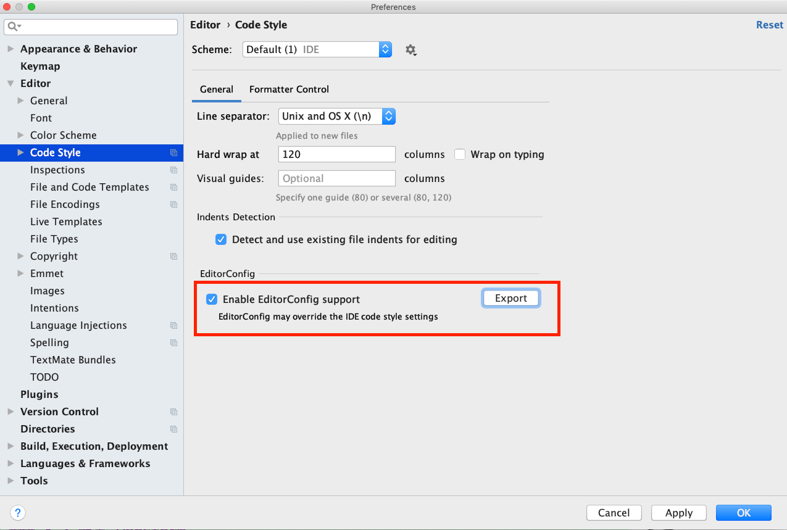
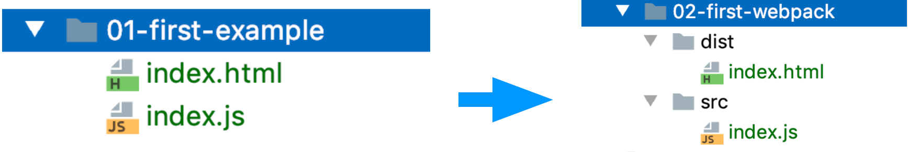

# 手把手教你创建一个易维护的 webpack 工程 (编写中)

[01]: https://webpack.js.org/guides/
[02]: https://www.webpackjs.com/guides/
[11]: http://momentjs.cn/
[21]: https://docs.npmjs.com/creating-a-package-json-file

## 前言

我发现有很多前端同学在**快速**实现产品经理**验证性**需求的时候，往往会采用简单的页面，也就是直接写在一个 html 上。简单页面确实可以快速搭建一个 demo，但是随着迭代的推进，越来越多的功能堆砌在了这个页面上。最终导致整个工程变得难以扩展、难以维护。

希望这个文档能帮助大家在 webpack 项目中，快速添加 `babel`、`postcss` 这样的代码转义工具。同时，也可添加了代码格式化和语法检查的工具，避免在一个项目中 `一千个程序员，就有一千种代码风格。`

> 开发人员一定要有远见！无论什么项目都应使用一个易扩展、易维护的架构。
>
> 以免给自己挖坑，到头来还得重构。

希望前端同学能够通过这个文档学会：

- webpack 工程（开发与生成分离）
- 添加 babel：转义`ES6+`语法；
- 添加 prettier：统一编码风格；
- 添加 eslint：检验 js 语法；
- 添加 babel-eslint：检查最新的 js 语法；
- 添加 postcss：转义新一代的 css；
- 添加 stylelint：检验 css 语法；
- 添加 lint-staged 与 husky：提交代码前，强制进行代码检查；
- 添加 commitlint：规范 commit 日志；
- 备选 sass

> **架构未必最优！如有好的建议，欢迎指出~**

## 目录：

1. [webpack 工程](#t01)
2. [添加 babel](#t02)
3. [添加 .editorconfig](#t03)
4. [添加 prettier](#t04)
5. [添加 eslint](#t05)
6. [添加 eslint-loader](#t06)

## <a id="t01">1.一个生产与开发分离的 webpack 工程</a>

这个工程是根据 [官方文档][01] 中的示例搭建的，只是增加了几个`plugin`。

如果有诸多不清楚的地方，强烈建议先学习一下 [官方文档][01]，也可以看一下[中文文档][02] ，里面的教程非常棒！！！

> **注意**：中文文档更新不及时。如果中文文档中的示例不好使，可以查看[官方文档][01]。

### 1.1 项目文件

[示例工程(01-base)](./examples/01-base) 的目录结构

```
|-- examples
    |-- index.html // html模板
    |-- package.json
    |-- build // 配置文件文件夹
    |   |-- webpack.base.js // webpack的通用配置
    |   |-- webpack.dev.js // webpack开发环境的配置
    |   |-- webpack.prod.js // webpack生产环境的配置
    |-- src
        |-- index.js // 入口文件
        |-- assets
            |-- style.css // 样式
```

### 1.2 package.json

#### 1.2.1 简单说明

在 `package.json` 中，注册了两个 `script`，以便于快速调用开发与生产的命令。

```
"scripts": {
  "dev": "webpack-dev-server --config build/webpack.dev.js",
  "build": "webpack --config build/webpack.prod.js"
}
```

同时，引用一些常用的`plugin`：

[clean-webpack-plugin](https://www.npmjs.com/package/clean-webpack-plugin): 通过 webpack 构建时，清除 dist 文件夹 \
[compression-webpack-plugin](https://www.npmjs.com/package/compression-webpack-plugin): 打包时，自动为 js、css 文件生成 gzip 文件 \
[html-webpack-plugin](https://www.npmjs.com/package/html-webpack-plugin): 生成 html5，并以 script 标签的形式引入打包后的 `bundle.js` 文件。 \
[mini-css-extract-plugin](https://www.npmjs.com/package/mini-css-extract-plugin): 抽取 css 文件 \
[webpack-bundle-analyzer](https://www.npmjs.com/package/webpack-bundle-analyzer): 分析打包出来的文件 \
[webpack-merge](https://www.npmjs.com/package/webpack-merge): 合并数组和对象，但不是覆盖！！！

#### 1.2.2 示例

[package.json](./examples/01-base/package.json)

```json
{
  "name": "01-base",
  "version": "1.0.0",
  "description": "",
  "main": "index.js",
  "scripts": {
    "dev": "webpack-dev-server --config build/webpack.dev.js",
    "build": "webpack --config build/webpack.prod.js"
  },
  "keywords": [],
  "author": "",
  "license": "ISC",
  "dependencies": {
    "clean-webpack-plugin": "^3.0.0",
    "compression-webpack-plugin": "^5.0.1",
    "css-loader": "^4.2.2",
    "html-webpack-plugin": "^4.3.0",
    "mini-css-extract-plugin": "^0.10.0",
    "style-loader": "^1.2.1",
    "webpack": "^4.44.1",
    "webpack-bundle-analyzer": "^3.8.0",
    "webpack-cli": "^3.3.12",
    "webpack-dev-server": "^3.11.0",
    "webpack-merge": "^5.1.2"
  }
}
```

### 1.3 webpack 配置

开发环境和生产环境的构建**目标**差异很大。

- 在开发环境中，我们需要强大的[热更新](https://webpack.docschina.org/concepts/hot-module-replacement/#how-it-works)功能，及 [dev server](https://webpack.docschina.org/configuration/dev-server/#devserver) 和 [proxy](https://webpack.docschina.org/configuration/dev-server/#devserverproxy)。
- 在生产环境中，我们的目标则转向于关注更小的 bundle，更轻量级的 [source map](http://www.ruanyifeng.com/blog/2013/01/javascript_source_map.html)，及**优化资源**以**改善**加载时间。

因此我们需要根据不同环境使用不同的**webpack 配置**。

> 热更新：
>
> - 保留在完全重新加载页面期间丢失的应用程序状态。
> - 只更新变更内容，以节省宝贵的开发时间。
> - 在源代码中 CSS/JS 产生修改时，会立刻在浏览器中进行更新，这几乎相当于在浏览器 devtools 直接更改样式。

在 `webpack.dev.js` 与 `webpack.prod.js` 中使用了功能强大的 `mode` 和 `devtool`。

#### 1.3.1 mode

webpack 4+ 提供了 [mode](https://webpack.js.org/configuration/mode/) 配置选项，能够自动调用 webpack 的**优化策略**。

```
string = 'production': 'none' | 'development' | 'production'
```

在 `webpack` 配置文件中

```javascript
module.exports = {
  mode: 'development' // 默认是 production
}
```

- 在 development（开发模式）下，会自动引用 NamedChunksPlugin 和 NameModulesPlugin。
- 在 production（生产模式）下，会自动引用 FlagDependencyUsagePlugin、FlagIncludedChunksPlugin、ModuleConcatenationPlugin、NoEmitOnErrorsPlugin、OccurrenceOrderPlugin、SideEffectsFlagPlugin 及 TerserPlugin。

#### 1.3.2 devtool

[devtool](https://www.webpackjs.com/configuration/devtool/) 选项控制**是否**生成以及**如何**生成 [source map](https://blog.teamtreehouse.com/introduction-source-maps)。

在 `webpack.dev.js` 中，主要使用以下两种 source map：

- cheap-module-eval-source-map ✅: 低开销的[source-map](https://blog.teamtreehouse.com/introduction-source-maps)，但只映射行数。（推荐）
- eval-source-map: 初始化 source map 的时候比较慢，但是重新构建时，提供比较快的速度，并能正确映射出报错的位置。

在 `webpack.prod.js` 中，主要使用以下三种 source map：

- source-map ✅: 整个 source map 作为独立文件生成，并为 bundle 添加一个引用注释。(推荐！需在**nginx**中设置访问.map 文件的**ip 白名单**，以保护代码安全。)
- hidden-source-map: hidden-source-map 与 source-map 相同，但是不会为 bundle 添加引用注释。
- nosource-source-map: 创建的 source map 不包括 源代码内容。只映射客户端上的堆栈信息，不会暴露所有源代码。

#### 1.3.3 其他配置

- 在 `webpack.dev.js` 中，添加了 [devServer](https://www.webpackjs.com/guides/development/#%E4%BD%BF%E7%94%A8-webpack-dev-server) 以便于开发过程中**模块热更新**。

- 在 `webpack.prod.js` 中，添加了 `optimization.slitChunks.chunks` ([SlitChunksPlugin](https://webpack.js.org/guides/code-splitting/#splitchunksplugin)) 选项，以把公共依赖抽出来，放到一个公用的 chunk 中。也做了少许优化。

#### 1.3.4 配置文件

> 本例是参考了 [官方的例子](https://webpack.js.org/guides/production/)，并做了一点调整。 [中文文档](https://www.webpackjs.com/guides/production/) 中的例子有点老，不适用于 webpack 4+。

[build/webpack.base.js](./examples/01-base/build/webpack.base.js):

```javascript
const path = require('path')

module.exports = {
  entry: {
    app: './src/index.js'
  },
  output: {
    filename: '[name].[hash].js',
    path: path.resolve(__dirname, '../dist')
  },
  module: {
    rules: [
      {
        test: /\.css$/,
        use: ['style-loader', 'css-loader']
      }
    ]
  }
}
```

> **注意**: output.filename 不能使用 [chunkhash]，只能使用 [hash]，否则在 **开发模式(dev)** 下会报错。

[build/webpack.dev.js](./examples/01-base/build/webpack.dev.js)

```javascript
// 合并数组和对象，但不是覆盖！！！
// https://www.npmjs.com/package/webpack-merge
const { merge } = require('webpack-merge')

// 生成 html5，并在body中使用script标签引入打包后的js文件。
// https://www.npmjs.com/package/html-webpack-plugin
const HtmlWebpackPlugin = require('html-webpack-plugin')

const base = require('./webpack.base')

module.exports = merge(base, {
  mode: 'development', // 声明开发模式
  devServer: {
    contentBase: '../dist',
    hot: true, // 热模块更新 - 局部更新
    host: '0.0.0.0', // 设置后，其他机器可以通过ip访问
    port: '8080', // 端口
    quiet: false,
    clientLogLevel: 'warning',
    proxy: {} // 跨域代理
  },
  // 'cheap-module-eval-source-map'低开销的source-map，但只映射行数。
  // 'eval-source-map'，初始化source map的时候比较慢，但是重新构建时，提供比较快的速度，并能正确映射出报错的位置
  // https://www.webpackjs.com/configuration/devtool/
  devtool: 'cheap-module-eval-source-map',
  plugins: [
    new HtmlWebpackPlugin({
      filename: 'index.html', // 生成的文件名
      template: 'index.html', // 使用的模板文件
      inject: true // 生成的script插到body底部
    })
  ]
})
```

[build/webpack.prod.js](./examples/01-base/build/webpack.prod.js)

```javascript
const path = require('path')
// 合并数组和对象，但不是覆盖！！！
// https://www.npmjs.com/package/webpack-merge
const { merge } = require('webpack-merge') // 合并数组和对象，但不是覆盖！！！

// 生成 gzip 文件
// https://www.npmjs.com/package/compression-webpack-plugin
const CompressionPlugin = require('compression-webpack-plugin')

// 分析打包出来的文件
// https://www.npmjs.com/package/webpack-bundle-analyzer
const BundleAnalyzerPlugin = require('webpack-bundle-analyzer').BundleAnalyzerPlugin

// 抽取css文件
// https://www.npmjs.com/package/mini-css-extract-plugin
const MiniCssExtractPlugin = require('mini-css-extract-plugin')

// 生成 html5，并在body中使用script标签引入打包后的js文件。
// https://www.npmjs.com/package/html-webpack-plugin
const HtmlWebpackPlugin = require('html-webpack-plugin')

// 清理 dist 文件夹
const { CleanWebpackPlugin } = require('clean-webpack-plugin')

const base = require('./webpack.base')
const config = {
  bundleAnalyzerReport: false,
  productionGzip: true
}

const webpackConfig = merge(base, {
  mode: 'production',
  output: {
    filename: '[name].[chunkhash].js',
    path: path.resolve(__dirname, '../dist')
  },
  // source-map: 整个source map 作为独立文件生成，并未bundle添加一个引用注释。
  // https://www.webpackjs.com/configuration/devtool/
  devtool: 'source-map',
  optimization: {
    splitChunks: { chunks: 'all' }
  },
  module: {
    rules: [
      {
        test: /\.css$/i,
        use: [
          {
            loader: MiniCssExtractPlugin.loader,
            options: {
              esModule: true
            }
          },
          'css-loader'
        ]
      }
    ]
  },
  plugins: [
    new CleanWebpackPlugin(),
    new MiniCssExtractPlugin(),
    new HtmlWebpackPlugin({
      filename: 'index.html',
      template: 'index.html',
      minify: {
        removeComments: true, // 移除html中的注释
        collapseWhitespace: true, // 去掉留白部分
        removeAttributeQuotes: true // 去掉属性中的引号
      },
      inject: true
    })
  ]
})

// 生成 gzip 文件
// https://www.npmjs.com/package/compression-webpack-plugin
if (config.productionGzip) {
  const CompressionWebpackPlugin = require('compression-webpack-plugin')
  webpackConfig.plugins.push(
    new CompressionWebpackPlugin({
      test: new RegExp('\\.(js|css)$'), //只打包 js和css 文件
      threshold: 10240,
      minRatio: 0.8
    })
  )
}

// 分析打包出来的文件
// https://www.npmjs.com/package/webpack-bundle-analyzer
if (config.bundleAnalyzerReport) {
  const BundleAnalyzerPlugin = require('webpack-bundle-analyzer').BundleAnalyzerPlugin
  webpackConfig.plugins.push(new BundleAnalyzerPlugin())
}

module.exports = webpackConfig
```

### 1.4 其他文件

[src/index.js](./examples/01-base/src/index.js)

```javascript
import './assets/style.css'

function foo() {
  document.body.innerText = 'hello world'
}

foo()
```

[src/assets/style.css](./examples/01-base/src/assets/style.css)

```css
body {
  background-color: red;
}
```

[index.html](./examples/01-base/index.html)

```html
<!DOCTYPE html>
<html lang="en">
  <head>
    <meta charset="UTF-8" />
    <title>模板</title>
  </head>
  <body></body>
</html>
```

### 1.5 运行结果

运行以下命令，查看结果

```bash
> yarn #安装依赖
> npm run dev
```

打开 <http://0.0.0.0:8080/> 地址查看结果：


---

## <a id="t02">2. 添加 babel</a>


[babel](https://www.babeljs.cn/) 是一个 JavaScript 编译器，允许我们在项目中使用下一代 JS 语法(ES 6 7 8 9...)。

比如箭头函数 ：

```javascript
// Babel 输入： ES2015 箭头函数
;[1, 2, 3].map((n) => n + 1)

// Babel 输出： ES5 语法实现的同等功能
;[1, 2, 3].map(function (n) {
  return n + 1
})
```

### 2.1 步骤

在项目中添加 `babel-loader` 的步骤：

- 安装依赖
- 在 `webpack配置文件` 中添加 `babel-loader` 的配置
- 添加 `.babelrc` 文件
- 指定 `browserslist`

示例工程 [02-add-babel-loader](./examples/02-add-babel-loader)

### 2.2 具体流程

### 2.2.1

在 webpack 项目中使用 `babel` 转义 ES6 以上的语法，最好的方式当然是使用 [babel-loader](https://www.npmjs.com/package/babel-loader) 了。`babel-loader`可以自动帮我们转译 ES6 以上的语法(Loader makes the life easier~ 🎉)。

运行以下命令来安装 `babel-loader`

```bash
yarn add babel-loader @babel/core @babel/preset-env @babel/plugin-transform-runtime core-js
```

#### 2.2.2 调整 webpack 配置

由于开发环境和生产环境都需要使用 `babel` 转译。因此，我们在 `webpack.base.js` 中添加 `babel-loader` 的配置。可参考 [官方例子](https://github.com/babel/babel-loader#usage)。

[build/webpack.base.js](./examples/02-add-babel-loader/build/webpack.base.js)

```javascript
const path = require('path')

module.exports = {
  entry: {
    app: './src/index.js'
  },
  output: {
    filename: '[name].[hash].js',
    path: path.resolve(__dirname, '../dist')
  },
  module: {
    rules: [
      {
        test: /\.css$/,
        use: ['style-loader', 'css-loader']
      },
      // ---- 在此添加 babel-loader 的配置 ----
      {
        test: /\.m?js$/,
        exclude: /(node_modules)/,
        use: {
          loader: 'babel-loader'
        }
      }
      // **** 在此添加 babel-loader 的配置 END ****
    ]
  }
}
```

#### 2.2.3 添加配置文件

在根目录下添加 `.babelrc` 文件：

[.babelrc](./examples/02-add-babel-loader/.babelrc)

```
{
  "presets": [
    [
      "@babel/preset-env",
      {
        "useBuiltIns": "usage", // babel 会参考目标（browserslist）及代码使用的特性，按需引用所需的 polyfills 方法
        "corejs": "3" // 使用 usage 的时候，需要声明 corejs的版本
      }
    ]
  ],
  "plugins": [
    [
      "@babel/plugin-transform-runtime"
    ]
  ]
}

```

在上面的配置中

- @babel/preset-env：是一系列插件的集合，包含了我们在 babel6 中常用的 es2015、es2016、es2017 等最新的语法转换插件。允许我们使用最新的 js 语法，比如 let、const、箭头函数等。
- "useBuiltIns": "usage"：在项目中按需添加 polyfills 中的方法。由于 `babel` 只进行语法转换（如箭头函数），你可以使用 `polyfill` 来支持新的全局变量，如 Promise 或 新的原生方法。@babel/polyfill 在 @babel 7.4 已经废弃了，可以通过使用 `@babel/preset-env` 来引入 polyfill，即在 `.babelrc` 中，配置 userbuiltIns: 'usage'。具体可以参考 [polyfill](https://babeljs.io/docs/en/babel-polyfill#usage-in-node-browserify-webpack) 及 [useBuiltIns](https://babeljs.io/docs/en/babel-preset-env#usebuiltins-usage)。
- @babel/plugin-transform-runtime：以沙箱垫片的方式防止污染全局，并抽离公共的 helper function，以节省代码的冗余。

#### 2.2.4 指定 browserslist


通过 [browserslist](https://github.com/browserslist/browserslist)，指定项目的**目标浏览器**的范围。

`browserslist` 广泛应用于多个库中：

- Babel
- postcss-preset-env
- Autoprefixer
- eslint
- stylelint

在 `package.json` 中配置 `browserslist`。

```json
{
  "name": "02-add-babel-loader",
  "version": "1.0.0",
  "description": "",
  "main": "index.js",
  "scripts": {
    "dev": "webpack-dev-server --config build/webpack.dev.js",
    "build": "webpack --config build/webpack.prod.js"
  },
  "keywords": [],
  "author": "",
  "license": "ISC",
  "dependencies": {
    "@babel/core": "^7.11.4",
    "@babel/preset-env": "^7.11.0",
    "babel-loader": "^8.1.0",
    "clean-webpack-plugin": "^3.0.0",
    "compression-webpack-plugin": "^5.0.1",
    "core-js": "3",
    "css-loader": "^4.2.2",
    "html-webpack-plugin": "^4.3.0",
    "mini-css-extract-plugin": "^0.10.0",
    "style-loader": "^1.2.1",
    "webpack": "^4.44.1",
    "webpack-bundle-analyzer": "^3.8.0",
    "webpack-cli": "^3.3.12",
    "webpack-dev-server": "^3.11.0",
    "webpack-merge": "^5.1.2"
  },
  "browserslist": ["> 0.25%", "not dead", "last 2 versions", "not ie <= 8"]
}
```

### 2.3 测试

调整 `index.js`，添加 es6 语法：

```javascript
const bar = {
  a: {
    b: 123,
    c: {
      d: 'hello',
      e() {
        console.info(123)
      }
    }
  }
}

const bb = {
  ...bar,
  app: [1, 2, 3, 4],
  bpp: 'hello world'.includes('ll')
}

document.body.innerText = `这个是 ${JSON.stringify(bb)}`
```

打开 <http://0.0.0.0:8080/> 页面显示：

```
这个是 {"a":{"b":123,"c":{"d":"hello"}},"app":[1,2,3,4],"bpp":true}
```

运行 `npm run build` 查看打包后的文件：

```javascript
// app.41ff3a5a6bab98ef169d.js
// ...

function u(e) {
  for (var r = 1; r < arguments.length; r++) {
    var t = null != arguments[r] ? arguments[r] : {}
    r % 2
      ? c(Object(t), !0).forEach(function (r) {
          o()(e, r, t[r])
        })
      : Object.getOwnPropertyDescriptors
      ? Object.defineProperties(e, Object.getOwnPropertyDescriptors(t))
      : c(Object(t)).forEach(function (r) {
          Object.defineProperty(e, r, Object.getOwnPropertyDescriptor(t, r))
        })
  }
  return e
}

var i = u(
  u(
    {},
    {
      a: {
        b: 123,
        c: {
          d: 'hello',
          e: function () {
            console.info(123)
          }
        }
      }
    }
  ),
  {},
  {
    app: [1, 2, 3, 4],
    bpp: 'hello world'.includes('ll')
  }
)
document.body.innerText = '这个是 '.concat(i)

// ...
```

通过打包后的文件，可以分析出，ES6 语法已经被转义了。其中 String.prototype.includes 被定义在 vendor~app.js 中。

### 2.4 示例工程

示例工程 [02-add-babel-loader](./examples/02-add-babel-loader)

### 2.5 总结

在项目中添加 `babel-loader` 的步骤：

- 安装依赖
- 在 `webpack配置文件` 中添加 `babel-loader` 的配置
- 添加 `.babelrc` 文件
- 指定 `browserslist`

### 2.6 参考

[babel 相关知识](#r-babel)

---

## <a id="t03">3. 添加 editorconfig</a>


`.editorconfig` 文件是为了在不同的开发环境上遵循 `.editorconfig` 的配置项，达到拥有同样的代码风格表现。

在前端工程中，即使**已经**有 `eslint` 及 `prettier` 这样的代码格式化工具，也可以用 `.editorconfig`的。可以使用 `.editorconfig` 对其他文件格式的代码风格进行控制，例如 `.py`、`.md`。

### 3.1 添加 .editorconfig 文件

在根目录下添加 `.editorconfig` 文件

```shell
# editorconfig.org
# 表示是最顶层的配置文件，IDE发现root设为true时，才会停止查找.editorconfig文件
root = true

[*]
# 设置缩进风格(tab是硬缩进，space为软缩进)
indent_style = space
# 用一个整数定义的列数来设置缩进的宽度，如果indent_style为tab，则此属性默认为tab_width
indent_size = 2
# 设置换行符，值为lf、cr和crlf
end_of_line = lf
# 设置编码，值为latin1、utf-8、utf-8-bom、utf-16be和utf-16le，不建议使用utf-8-bom
charset = utf-8
# 设为true表示会去除换行行首的任意空白字符。
trim_trailing_whitespace = true
# 设为true表示使文件以一个空白行结尾
insert_final_newline = true
```

### 3.2 配置 webstorm

如下图



done！

---

## <a id="t04">4. 添加 prettier</a>


[Prettier](https://prettier.io/) 是一个代码格式工具，支持基本主流前端的语言（js, ts, ES6, ES7, markdown 等等）。 `Prettier` 会根据书写的代码，重新解析和构建显示格式。

示例工程：[03-add-prettier](./examples/03-add-prettier)

### 4.1 步骤

在工程中添加 `prettier` 的步骤：

- 安装依赖
- 创建 `.prettierrc.js` 文件
- 添加 IDE 插件

### 4.2 具体流程

#### 4.2.1 安装依赖

```bash
yarn add prettier --dev --exact
```

#### 4.2.2 添加配置文件

在工程的根目录下，创建 `.prettierrc.js` 文件。

```javascript
module.exports = {
  printWidth: 120, // 每行代码最大长度 默认为80
  tabWidth: 2, //一个tab代表几个空格数
  useTabs: false, //是否使用tab进行缩进
  semi: false, // 声明后带分号
  singleQuote: true, // 使用单引号
  trailingComma: 'none'
}
```

#### 4.2.3 在 IDE 中使用插件

##### webstorm

在 webpack 中使用 `prettier插件`，在保存(ctrl + S)的时候，自动调整文件的格式。



##### vscode

vscode 可参考：

- <https://jingyan.baidu.com/article/a24b33cdb2119958fe002bde.html>
- <http://www.dlxp.cn/vscode-prettier-config.html>

### 4.3 示例工程

示例工程：[03-add-prettier](./examples/03-add-prettier)

```
|-- examples
    |-- .babelrc // babel配置
    |-- .editorconfig // editorconfig 的配置
    |-- .prettierrc.js // prettier 的配置
    |-- index.html
    |-- package.json
    |-- build
    |   |-- webpack.base.js
    |   |-- webpack.dev.js
    |   |-- webpack.prod.js
    |-- src
        |-- index.js
        |-- assets
            |-- style.css

```

---

## <a id="t05">5. ESLint</a>

`.editorconfig` 与 `prettier` 可以自动调整代码风格，但是却无法约束语法。因此，还是需要 [ESLint](https://eslint.org/docs/user-guide/getting-started) 这样专业的代码**语法**检查工具。


ESLint 是在 ECMAScript/JavaScript 代码中识别和报告模式匹配的工具，它的目标是**保证代码的一致性**和**避免错误**。在 webpack 项目中，自然是要使用万能的 `loader` 了，以便于通过 `loader` 自动检查 JS 代码。

在安装 `eslint-loader` 之前，我们先安装 ESLint 及其配置文件。

### 5.1 步骤

- 安装依赖
- 生成 `.eslintrc` 文件
- 添加 `eslint-plugin-prettier` 插件
- 调整 `.eslintrc` 文件

示例工程：[04-add-eslint](./examples/04-add-eslint)

### 5.2 具体流程

#### 5.2.1 安装 ESLint

```shell
yarn add eslint
```

#### 5.2.2 生成 .eslintrc 文件

创建 `.eslintrc.js` 文件有两种方法：

- 直接创建 `.eslintrc.js` 文件
- 运行命令生成 `.eslintrc.js` 文件

##### 方法一：直接使用配置好的 `.eslintrc.js` 文件

安装依赖

```bash
yarn add eslint-config-standard eslint-plugin-standard eslint-plugin-promise eslint-plugin-import eslint-plugin-node -D
```

创建 `.eslintrc.js` 文件

```javascript
module.exports = {
  env: {
    browser: true,
    es2020: true
  },
  extends: ['standard'],
  parserOptions: {
    ecmaVersion: 12,
    sourceType: 'module'
  },
  rules: {}
}
```

##### 方法二： 自动生成 `.eslintrc.js` 文件

安装完 `eslint` 后，运行 `npx eslint --init` 以便自动生成 `.eslintrc` 配置文件。

npx 的用法：[阮一峰-npx 使用教程](http://www.ruanyifeng.com/blog/2019/02/npx.html)

在下面三个选项中，选择第三项：

```
npx eslint --init
? How would you like to use ESLint? …
  To check syntax only
  To check syntax and find problems
❯ To check syntax, find problems, and enforce code style
```

`module` 的类型中，选择 `JavaScript modules (import/export)`

```
npx eslint --init
✔ How would you like to use ESLint? · style
? What type of modules does your project use? …
❯ JavaScript modules (import/export)
  CommonJS (require/exports)
  None of these
```

`framework` 中选择 `None of these`

```
npx eslint --init
✔ How would you like to use ESLint? · style
✔ What type of modules does your project use? · esm
? Which framework does your project use? …
  React
  Vue.js
❯ None of these
```

然后选择在 `Browser` 上运行代码。

```
npx eslint --init
✔ How would you like to use ESLint? · style
✔ What type of modules does your project use? · esm
✔ Which framework does your project use? · none
✔ Does your project use TypeScript? · No / Yes
? Where does your code run? …  (Press <space> to select, <a> to toggle all, <i> to invert selection)
✔ Browser
✔ Node
```

代码风格选择第一项

```
npx eslint --init
✔ How would you like to use ESLint? · style
✔ What type of modules does your project use? · esm
✔ Which framework does your project use? · none
✔ Does your project use TypeScript? · No / Yes
✔ Where does your code run? · browser
? How would you like to define a style for your project? …
❯ Use a popular style guide
  Answer questions about your style
  Inspect your JavaScript file(s)
```

代码规范选择 `Standard` 标准的格式

```
npx eslint --init
✔ How would you like to use ESLint? · style
✔ What type of modules does your project use? · esm
✔ Which framework does your project use? · none
✔ Does your project use TypeScript? · No / Yes
✔ Where does your code run? · browser
✔ How would you like to define a style for your project? · guide
? Which style guide do you want to follow? …
  Airbnb: https://github.com/airbnb/javascript
❯ Standard: https://github.com/standard/standard
  Google: https://github.com/google/eslint-config-google
```

配置文件的类型中，选择 `JavaScript`

```
npx eslint --init
✔ How would you like to use ESLint? · style
✔ What type of modules does your project use? · esm
✔ Which framework does your project use? · none
✔ Does your project use TypeScript? · No / Yes
✔ Where does your code run? · browser
✔ How would you like to define a style for your project? · guide
✔ Which style guide do you want to follow? · standard
? What format do you want your config file to be in? …
❯ JavaScript
  YAML
  JSON
```

自此，在项目的根目录下，生成了 `.eslintrc.js` 文件

```
module.exports = {
  'env': {
    'browser': true,
    'es2020': true
  },
  'extends': [
    'standard'
  ],
  'parserOptions': {
    'ecmaVersion': 12,
    'sourceType': 'module'
  },
  'rules': {}
}
```

**动态例子**


#### 5.2.3 添加 eslint-plugin-prettier 与 eslint-config-prettier 插件

接下来我们会安装两个插件，让 `prettier` 能够更好的配合 `eslint` 检查我们的代码。

[eslint-plugin-prettier](https://github.com/prettier/eslint-plugin-prettier)：插件会调用 prettier 对你的代码风格进行检查。

[eslint-config-prettier](https://github.com/prettier/eslint-config-prettier)： Prettier 与 Linter 工具配合的时候，配置会彼此冲突。为了解决这个问题，可以使用 [eslint-config-prettier](https://github.com/prettier/eslint-config-prettier)插件，让 Prettier 的配置覆盖 EsLint 的配置。

##### 安装插件

```bash
yarn add eslint-plugin-prettier eslint-config-prettier eslint-config-recommended -D
```

#### 5.2.4 调整 .eslintrc.js 文件

我们可以使用 prettier 提供的配置 `plugin:prettier/recommended`，它会做三件事：

- 开启 `eslint-plugin-prettier`
- 设置 `prettier/prettier` rule 为 "error"
- 继承 `eslint-config-prettier` 的配置

具体流程：在 `extends` 列表中，添加 'eslint:recommended' 和 'plugin:prettier/recommended'。

[.eslintrc.js](./examples/04-add-eslint/.eslintrc.js)

```javascript
module.exports = {
  env: {
    browser: true,
    es2020: true
  },
  extends: ['eslint:recommended', 'plugin:prettier/recommended'],
  parserOptions: {
    ecmaVersion: 12,
    sourceType: 'module'
  }
}
```

### 5.3 测试

#### 调整 `src/index.js`

[src/index.js](./examples/04-add-eslint/src/index.js)

```
const bar = {
  a: {
    b: 123,
    c: {
      d: 'hello',
      e () {
        // XXXXXX e后括号的格式不对
        console.info(123)
      }
    }
  }
}

// XXXXXX规则中，不能以分号结尾。
const bb = {
  ...bar,
  app: [1, 2, 3, 4],
  bpp: 'hello world'.includes('ll')
};

document.body.innerText = `这个是 ${JSON.stringify(bb)}`
```

#### 运行命令

运行 `npx eslint src/**/*.js` 命令来检查工程中的 js 语法，来验证 eslint 是否配置成功。

#### 查看结果

```
npx eslint src/**/*.js

/Users/CodingNutsZac/Documents/founder/git/test/test-webpack-tutorial/src/index.js
   7:8  error  Delete `·`  prettier/prettier
  19:2  error  Delete `;`  prettier/prettier

✖ 2 problems (2 errors, 0 warnings)
  2 errors and 0 warnings potentially fixable with the `--fix` option.

```

到目前为止，`eslint配置`正确。

### 5.4 总结

添加 `eslint` 的步骤

- 安装依赖
- 生成 `.eslintrc` 文件
- 添加 `eslint-plugin-prettier` 插件
- 调整 `.eslintrc` 文件

---

## <a id="t06">6. 添加 eslint-loader</a>


自此 eslint 和 prettier 都添加完了，但是无法通过 `webpack` 自动提示。因此这一步中，我们在项目中添加 [eslint-loader](https://github.com/webpack-contrib/eslint-loader)。

#### 6.1 安装 eslint-loader

```bash
yarn add eslint-loader -D
```

#### 6.2 调整 `webpack.base.js` 的配置

添加 `babel-loader` 的配置

[build/webpack.base.js](./examples/04-add-eslint/build/webpack.base.js)

```javascript
const path = require('path')

module.exports = {
  entry: {
    app: './src/index.js'
  },
  output: {
    filename: '[name].[hash].js',
    path: path.resolve(__dirname, '../dist')
  },
  module: {
    rules: [
      {
        test: /\.css$/,
        use: ['style-loader', 'css-loader']
      },
      // 在此添加 eslint-loader 的配置
      {
        enforce: 'pre',
        test: /\.js$/,
        exclude: /node_modules/,
        loader: 'eslint-loader',
        options: {
          cache: true,
          fix: false // 自动修复，对 ide 不够友好。如果，webstorm也开启了自动修复，会与eslint-loader互相冲突。
          // failOnError: true, // 如果有格式错误，不进行编译
          // failOnWarning: true
        }
      },
      // END 在此添加 eslint-loader 的配置
      // 在此添加 babel-loader 的配置
      {
        test: /\.m?js$/,
        exclude: /(node_modules)/,
        use: {
          loader: 'babel-loader'
        }
      }
      // END 在此添加 babel-loader 的配置
    ]
  }
}
```

### 6.3 测试 eslint 是否生效

运行 `yarn run dev` 启动工程

改写 `index.js`，来测试 `es-loader` 是否生效

```
const bar = {
  a: {
    b: 123,
    c: {
      d: 'hello',
      e () {
        // XXXXXX e后括号的格式不对
        console.info(123)
      }
    }
  }
}

// XXXXXX规则中，不能以分号结尾。
const bb = {
  ...bar,
  app: [1, 2, 3, 4],
  bpp: 'hello world'.includes('ll')
};

document.body.innerText = `这个是 ${JSON.stringify(bb)}`
```

这时，控制台会报出错误的提示

```
ERROR in ./src/index.js
Module Error (from /Users/CodingNutsZac/Documents/gitee/webpack-project-tutorial/node_modules/eslint-loader/dist/cjs.js):

/Users/CodingNutsZac/Documents/gitee/webpack-project-tutorial/examples/04-add-eslint/src/index.js
   6:8  error  Delete `·`  prettier/prettier
  17:2  error  Delete `;`  prettier/prettier

✖ 2 problems (2 errors, 0 warnings)
  2 errors and 0 warnings potentially fixable with the `--fix` option.

ℹ ｢wdm｣: Failed to compile.

```

使用 webstorm 快捷键或者 vscode 快捷键进行修复，或者手动修复后，项目恢复正常。

### 6.4 示例工程

示例工程：[04-add-eslint](./examples/04-add-eslint)

### 6.5 总结

添加 eslint-loader 的步骤：

- 安装依赖
- 调整 webpack的配置。

---

# 以下未修改完

## <a id="t07">7. 添加 postcss</a>

[postcss](https://www.postcss.com.cn/) 是一个用 JavaScript 工具和插件转换 **CSS 代码**的工具。

- postcss 能够自动为**css 规则**添加前缀。
- postcss 能够将最新的**css 语法**转换成大多数浏览器都能理解的语法。
- postcss 能够使用 `stylelint` 强化一致性约束避免样式表中的错误。

### 5.1 安装 postcss-loader

同样的，我们在项目中直接使用 `postcss-loader` 来使用`postcss`的功能。

```bash
yarn add postcss-loader postcss-load-config
```

安装 postcss 相关的 plugins

```bash
yarn add postcss-cssnext postcss-import
```

- postcss-cssnext：允许使用下一代 css 语法
- postcss-import：@import

### 5.2 创建 `.postcssrc.js` 文件

```javascript
// .postcssrc.js
module.exports = {
  plugins: [
    require('postcss-import'), //
    // require('autoprefixer'), // 自动添加浏览器前缀（已经包含在 post-cssnext 中了）
    require('postcss-cssnext') // 使用下一代css语法
  ]
}
```

### 5.3 调整 `webpack.base.js`

在 `webpack.base.js` 中，添加 `loader`。可参考 [postcss-loader](https://www.npmjs.com/package/postcss-loader)。

```javascript
// webpack.base.js
const path = require('path')

module.exports = {
  entry: {
    app: './src/index.js'
  },
  output: {
    filename: '[name].[hash].js',
    path: path.resolve(__dirname, '../dist')
  },
  module: {
    rules: [
      {
        test: /\.css$/,
        use: [
          'style-loader',
          // 在此添加 post-loader 的配置
          {
            loader: 'css-loader',
            options: {
              importLoaders: 1
            }
          },
          {
            loader: 'postcss-loader'
          }
          // END 在此添加 post-loader 的配置
        ]
      },
      // 在此添加 eslint-loader 的配置
      {
        enforce: 'pre',
        test: /\.js$/,
        exclude: /node_modules/,
        loader: 'eslint-loader',
        options: {
          cache: true,
          fix: false // 自动修复，对ide 不够友好
          // failOnError: true, // 如果有格式错误，不进行编译
          // failOnWarning: true
        }
      },
      // END 在此添加 eslint-loader 的配置
      // 在此添加 babel-loader 的配置
      {
        test: /\.m?js$/,
        exclude: /(node_modules)/,
        use: {
          loader: 'babel-loader'
        }
      }
      // END 在此添加 babel-loader 的配置
    ]
  }
}
```

#### 4.4 调整 `webpack.prod.js`

由于 `webpack.prod.js` 中 css 的配置与 base 中的不一样，所以需要分别配置。

```javascript
const path = require('path')
// 合并数组和对象，但不是覆盖！！！
// https://www.npmjs.com/package/webpack-merge
const { merge } = require('webpack-merge') // 合并数组和对象，但不是覆盖！！！

// 生成 gzip 文件
// https://www.npmjs.com/package/compression-webpack-plugin
const CompressionPlugin = require('compression-webpack-plugin')

// 分析打包出来的文件
// https://www.npmjs.com/package/webpack-bundle-analyzer
const BundleAnalyzerPlugin = require('webpack-bundle-analyzer').BundleAnalyzerPlugin

// 抽取css文件
// https://www.npmjs.com/package/mini-css-extract-plugin
const MiniCssExtractPlugin = require('mini-css-extract-plugin')

// 生成 html5，并在body中使用script标签引入打包后的js文件。
// https://www.npmjs.com/package/html-webpack-plugin
const HtmlWebpackPlugin = require('html-webpack-plugin')

// 清理 dist 文件夹
const { CleanWebpackPlugin } = require('clean-webpack-plugin')

const base = require('./webpack.base')
const config = {
  bundleAnalyzerReport: false,
  productionGzip: true
}

const webpackConfig = merge(base, {
  mode: 'production',
  output: {
    filename: '[name].[chunkhash].js',
    path: path.resolve(__dirname, '../dist')
  },
  // source-map: 整个source map 作为独立文件生成，并未bundle添加一个引用注释。
  // https://www.webpackjs.com/configuration/devtool/
  devtool: 'source-map',
  optimization: {
    splitChunks: { chunks: 'all' }
  },
  module: {
    rules: [
      {
        test: /\.css$/i,
        use: [
          {
            loader: MiniCssExtractPlugin.loader,
            options: {
              esModule: true
            }
          }, // 在此添加 post-loader 的配置
          {
            loader: 'css-loader',
            options: {
              importLoaders: 1
            }
          },
          {
            loader: 'postcss-loader'
          }
          // END 在此添加 post-loader 的配置
        ]
      }
    ]
  },
  plugins: [
    new CleanWebpackPlugin(),
    new MiniCssExtractPlugin({
      filename: '[name].[chunkhash].css' // 调整输出css文件的名字
    }),
    new HtmlWebpackPlugin({
      filename: 'index.html',
      template: 'index.html',
      minify: {
        removeComments: true, // 移除html中的注释
        collapseWhitespace: true, // 去掉留白部分
        removeAttributeQuotes: true // 去掉属性中的引号
      },
      inject: true
    })
  ]
})

// 生成 gzip 文件
// https://www.npmjs.com/package/compression-webpack-plugin
if (config.productionGzip) {
  const CompressionWebpackPlugin = require('compression-webpack-plugin')
  webpackConfig.plugins.push(
    new CompressionWebpackPlugin({
      test: new RegExp('\\.(js|css)$'), //只打包 js和css 文件
      threshold: 10240,
      minRatio: 0.8
    })
  )
}

// 分析打包出来的文件
// https://www.npmjs.com/package/webpack-bundle-analyzer
if (config.bundleAnalyzerReport) {
  const BundleAnalyzerPlugin = require('webpack-bundle-analyzer').BundleAnalyzerPlugin
  webpackConfig.plugins.push(new BundleAnalyzerPlugin())
}

module.exports = webpackConfig
```

#### 4.4 调整项目

调整项目中的文件以便于测试。

调整 `style.css` 文件，并在 `index.js`中引用 css 文件

```css
::placeholder {
  color: gray;
}

body {
  background-color: red;
}

.example {
  display: flex;
  position: relative;
  transform: translate(10, 10);
}
```

`index.js`文件

```javascript
import './assets/style.css'

document.body.innerHTML = `<div class="example">hello world</div>`
```

#### 4.5 测试打包

运行打包命令

```bash
npm run build
```

查看 `dist/app.css`，原来的 css 文件已经转译。

```css
::-webkit-input-placeholder {
  color: gray;
}

::-moz-placeholder {
  color: gray;
}

::-ms-input-placeholder {
  color: gray;
}

::placeholder {
  color: gray;
}

body {
  background-color: red;
}

.example {
  display: -webkit-box;
  display: -ms-flexbox;
  display: flex;
  position: relative;
  -webkit-transform: translate(10, 10);
  transform: translate(10, 10);
}

/*# sourceMappingURL=app.2ae83414e4418720f37c.css.map*/
```

### 5. stylelint

#### 5.1 安装 stylelint

运行命令安装 stylelint

```bash
yarn add stylelint stylelint-config-standard
```

添加 `.stylelintrc` 配置文件

```json
{
  "extends": "stylelint-config-standard"
}
```

调整 `.postcssrc.js` 文件，添加 `stylelint` plugin

```javascript
module.exports = {
  plugins: [
    require('stylelint'), // 添加 stylelint 插件
    require('precss'),
    // require('autoprefixer'), // 已经包含在 post-cssnext 中了
    require('postcss-cssnext'),
    require('postcss-import')
  ]
}
```

#### 5.2 测试

调整 `style.css` 的格式，查看验证的结果

```css
::placeholder {
  color: gray;
}

body {
  background-color: #00;
}

.example {
  display: flex;
  position: relative;
  transform: translate(10, 10);
}
```

在控制台会出现以下提醒

```
WARNING in ./src/assets/style.css (/Users/CodingNutsZac/Documents/gitee/webpack-project-tutorial/node_modules/css-loader/dist/cjs.js??ref--4-1!/Users/CodingNutsZac/Documents/gitee/webpack-project-tutorial/node_modules/postcss-loader/src!./src/assets/style.css)
Module Warning (from /Users/CodingNutsZac/Documents/gitee/webpack-project-tutorial/node_modules/postcss-loader/src/index.js):
Warning

(6:21) Unexpected invalid hex color "#00" (color-no-invalid-hex)
 @ ./src/assets/style.css 2:26-161 43:4-64:5 46:18-153
 @ ./src/index.js

WARNING in ./src/assets/style.css (/Users/CodingNutsZac/Documents/gitee/webpack-project-tutorial/node_modules/css-loader/dist/cjs.js??ref--4-1!/Users/CodingNutsZac/Documents/gitee/webpack-project-tutorial/node_modules/postcss-loader/src!./src/assets/style.css)
Module Warning (from /Users/CodingNutsZac/Documents/gitee/webpack-project-tutorial/node_modules/postcss-loader/src/index.js):
Warning

(9:1) Expected no more than 1 empty line (max-empty-lines)
 @ ./src/assets/style.css 2:26-161 43:4-64:5 46:18-153
 @ ./src/index.js

```

调整后，程序恢复正常

### 6. 规范检查增强(husky + lint-staged)

---

## 参考

npm 文档： <https://docs.npmjs.com> \
webpack 官方文档： <https://webpack.js.org/> \
webpack 中文文档： <https://www.webpackjs.com/>

### <a id="r-babel">添加 babel</a>

#### 参考

- babel: <https://babeljs.io/>
- babel-loader: <https://github.com/babel/babel-loader>
- polyfill: <https://babeljs.io/docs/en/babel-polyfill>
- babel-preset-env: <https://babeljs.io/docs/en/babel-preset-env>
- babel-plugin-transform-runtime: <https://babeljs.io/docs/en/babel-plugin-transform-runtime>
- browserslist: <https://github.com/browserslist/browserslist#queries>

#### 推荐文章

- 腾讯云 babel： <https://cloud.tencent.com/developer/doc/1260>
- babel 详解： <https://blog.liuyunzhuge.com/tags/babel/>

## 推荐网站：

十分钟学会 markdown 语法： <https://commonmark.org/help/>

备忘:

https://github.com/GoogleChromeLabs/webpack-libs-optimizations

https://github.com/GoogleChromeLabs/webpack-training-project

babel: https://blog.csdn.net/i10630226/article/details/108038087

babel: https://blog.liuyunzhuge.com/tags/babel/

webpack 相关的文档： https://blog.csdn.net/i10630226

.editorconfig: https://juejin.im/post/6860440041039069191

.prettier: https://juejin.im/post/6860440041039069191

prettier: https://juejin.im/post/6844903904585482253

https://github.com/prettier/eslint-plugin-prettier

https://github.com/webpack-contrib/eslint-loader

https://juejin.im/user/3474112476622350

https://www.npmjs.com/package/babel-eslint

https://github.com/webpack-contrib/eslint-loader

https://juejin.im/post/6860440041039069191#heading-13

https://juejin.im/post/6861925256995700744

https://www.jianshu.com/p/7473376f5a11

postcss: https://github.com/postcss/postcss
