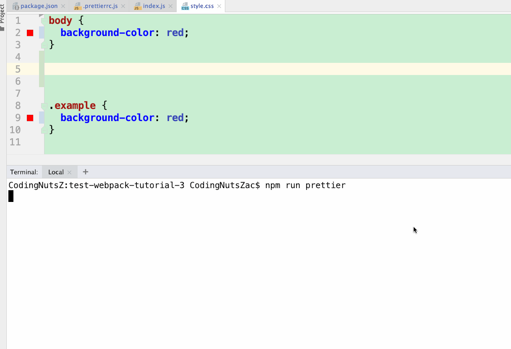

## 【step-by-step】4. 使用 prettier 格式化代码

> 本篇文档的目的是希望前端同学能够以 `复制粘贴` 的方式，快速在 [webpack 工程](../examples/01-base) 中添加插件。因此，一些说明性质的知识将以`推荐阅读`的方式推荐给大家。


<!-- START doctoc generated TOC please keep comment here to allow auto update -->
<!-- DON'T EDIT THIS SECTION, INSTEAD RE-RUN doctoc TO UPDATE -->

- [TL;DR](#tldr)
- [4.1 安装步骤](#41-%E5%AE%89%E8%A3%85%E6%AD%A5%E9%AA%A4)
- [4.2 具体流程](#42-%E5%85%B7%E4%BD%93%E6%B5%81%E7%A8%8B)
  - [4.2.1 安装依赖](#421-%E5%AE%89%E8%A3%85%E4%BE%9D%E8%B5%96)
  - [4.2.2 添加配置文件](#422-%E6%B7%BB%E5%8A%A0%E9%85%8D%E7%BD%AE%E6%96%87%E4%BB%B6)
  - [4.2.3 在 IDE 中使用插件](#423-%E5%9C%A8-ide-%E4%B8%AD%E4%BD%BF%E7%94%A8%E6%8F%92%E4%BB%B6)
    - [webstorm](#webstorm)
    - [vscode](#vscode)
- [4.3 示例工程](#43-%E7%A4%BA%E4%BE%8B%E5%B7%A5%E7%A8%8B)
- [推荐文档](#%E6%8E%A8%E8%8D%90%E6%96%87%E6%A1%A3)

<!-- END doctoc generated TOC please keep comment here to allow auto update -->

我们期待能有一套自动化工具，帮助我们自动调整代码风格，自动审查代码语法。使我们能够把更多的精力投放到业务开发中，而不是千奇百怪的代码风格上。

因此，我们在工程中添加几个工具：

- [x] .editorconfig ： 让IDE遵循同样的编写规则。
- [ ] prettier ： 代码格式化工具。
- [ ] eslint ： 审查 js 语法。
- [ ] stylelint ： 审查 css 语法。
- [ ] commitlint ： 审查 git commit 信息格式。


### TL;DR

> Building and enforcing a style guide

[Prettier](https://prettier.io/) 是一个代码格式工具，支持主流的前端语言（js, ts, ES6, ES7, markdown 等等）。 `Prettier` 会根据书写的代码，重新解析和构建代码的显示格式，确保团队使用统一的代码风格。

### 4.1 安装步骤

根据 [prettier.io](https://prettier.io/docs/en/install.html) 中的示例说明，我们在 [webpack工程02](../examples/02-add-babel-loader) 中添加 `prettier` 的步骤如下：

- 安装依赖
- 创建 `.prettierrc.js` 文件
- 添加 IDE 插件

示例工程：[03-add-prettier](../examples/03-add-prettier)

### 4.2 具体流程

#### 4.2.1 安装依赖

```bash
yarn add prettier --dev --exact
```

#### 4.2.2 添加配置文件

在工程的根目录下，创建 `.prettierrc.js` 文件。

```javascript
module.exports = {
  printWidth: 120, // 每行代码最大长度 默认为80
  tabWidth: 2, //一个tab代表几个空格数
  useTabs: false, //是否使用tab进行缩进
  semi: false, // 声明后带分号
  singleQuote: true, // 使用单引号
  trailingComma: 'none',
  endOfLine: 'auto'
}
```

> 由于在windows与mac系统中的换行符不同，建议在 `.prettierrc.js` 文件中添加 `endOfLine` 属性。（由于洋提供建议）

#### 4.2.3 添加脚本命令（可选）

在 `package.json` 中，添加 `prettier` 命令：

```json
{
  "script": {
    "prettier": "prettier --write ./src/**.{js,css}"
  }
}
```

运行 `npm run prettier` 命令，`prettier` 可以按照配置文件调整 `src` 文件夹中的代码。

### 4.3 测试

为了测试 `prettier` 是否安装成功，我们弄乱代码中的格式，然后使用 `prettier` 进行修复。

#### 调整文件

调整 `index.js` 的文件格式

```
// 两个问题：1. 多行； 2. 段位分号；
import './assets/style.css';


function foo() {
  document.body.innerText = 'hello world';
}


foo();

```

以及 `src/assets/style.css` 文件的格式

```
body {
  background-color: red;
}


.example {
  background-color: red;
}

```

#### 运行 prettier

运行命令 `npx prettier --write ./src/**` 后，查看 `src文件夹` 中的 js 文件和 css 文件是否格式化了。



done！

### 4.4 在 IDE 中使用插件

##### webstorm

在 webpack 中使用 `prettier插件`，在保存(ctrl + S)的时候，自动调整文件的格式。


##### vscode

vscode 可参考：

- <https://jingyan.baidu.com/article/a24b33cdb2119958fe002bde.html>
- <http://www.dlxp.cn/vscode-prettier-config.html>

### 4.5 示例工程

示例工程：[03-add-prettier](../examples/03-add-prettier)

```
|-- examples
    |-- .babelrc // babel配置
    |-- .editorconfig // editorconfig 的配置
    |-- .prettierrc.js // prettier 的配置
    |-- index.html
    |-- package.json
    |-- build
    |   |-- webpack.base.js
    |   |-- webpack.dev.js
    |   |-- webpack.prod.js
    |-- src
        |-- index.js
        |-- assets
            |-- style.css

```

### 推荐阅读

- [项目创建从 editorconfig 和 prettier 开始](https://juejin.im/post/6860440041039069191)
- [prettier 指“北”](https://juejin.im/post/6844903904585482253)
- [eslint 与 prettier 实现代码规范自动格式化](https://juejin.im/post/6844903877544771592)
