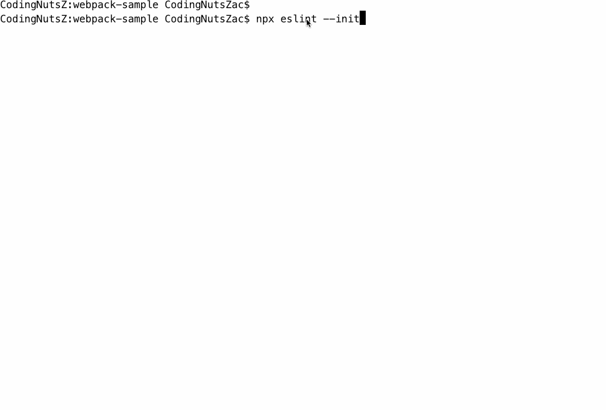

## 【step-by-step】5. 使用 ESLint 审查 JS 代码

> 本篇文档的目的是希望前端同学能够以 `复制粘贴` 的方式，快速在 [webpack 工程](../examples/01-base) 中添加插件。因此，一些说明性质的知识将以`推荐阅读`的方式推荐给大家。

<!-- START doctoc generated TOC please keep comment here to allow auto update -->
<!-- DON'T EDIT THIS SECTION, INSTEAD RE-RUN doctoc TO UPDATE -->


- [TL;DR](#tldr)
- [5.1 步骤](#51-%E6%AD%A5%E9%AA%A4)
- [5.2 具体流程](#52-%E5%85%B7%E4%BD%93%E6%B5%81%E7%A8%8B)
  - [5.2.1 安装 ESLint](#521-%E5%AE%89%E8%A3%85-eslint)
  - [5.2.2 生成 .eslintrc 文件](#522-%E7%94%9F%E6%88%90-eslintrc-%E6%96%87%E4%BB%B6)
    - [方法一：创建 `.eslintrc.js` 配置文件](#%E6%96%B9%E6%B3%95%E4%B8%80%E5%88%9B%E5%BB%BA-eslintrcjs-%E9%85%8D%E7%BD%AE%E6%96%87%E4%BB%B6)
    - [方法二：运行脚本](#%E6%96%B9%E6%B3%95%E4%BA%8C%E8%BF%90%E8%A1%8C%E8%84%9A%E6%9C%AC)
  - [5.2.3 添加 eslint-plugin-prettier 与 eslint-config-prettier 插件](#523-%E6%B7%BB%E5%8A%A0-eslint-plugin-prettier-%E4%B8%8E-eslint-config-prettier-%E6%8F%92%E4%BB%B6)
  - [5.2.4 调整 .eslintrc.js 文件](#524-%E8%B0%83%E6%95%B4-eslintrcjs-%E6%96%87%E4%BB%B6)
- [5.3 测试](#53-%E6%B5%8B%E8%AF%95)
  - [调整 `src/index.js`](#%E8%B0%83%E6%95%B4-srcindexjs)
  - [运行命令](#%E8%BF%90%E8%A1%8C%E5%91%BD%E4%BB%A4)
  - [查看结果](#%E6%9F%A5%E7%9C%8B%E7%BB%93%E6%9E%9C)
- [5.4 总结](#54-%E6%80%BB%E7%BB%93)
- [5.5 示例工程](#55-%E7%A4%BA%E4%BE%8B%E5%B7%A5%E7%A8%8B)
- [推荐阅读](#%E6%8E%A8%E8%8D%90%E9%98%85%E8%AF%BB)

<!-- END doctoc generated TOC please keep comment here to allow auto update -->

我们期待能有一套自动化工具，帮助我们自动调整代码风格，自动审查代码语法。使我们能够把更多的精力投放到业务开发中，而不是千奇百怪的代码风格上。

因此，我们在工程中添加几个工具：

- [x] .editorconfig ： 让IDE遵循同样的编写规则。
- [x] prettier ： 代码格式化工具。
- [ ] eslint ： 审查 js 语法。
- [ ] stylelint ： 审查 css 语法。
- [ ] commitlint ： 审查 git commit 信息格式。

`.editorconfig` 与 `prettier` 可以自动调整代码风格，却无法约束语法。因此，还是需要 [ESLint](https://eslint.org/docs/user-guide/getting-started) 这样专业的代码**语法**检查工具。

### TL;DR


ESLint 是在 ECMAScript/JavaScript 代码中识别和报告模式匹配的工具，它的目标是**保证代码的一致性**和**避免错误**。在 webpack 项目中，使用 `eslint-loader` 自动检查 JS 代码。

在安装 `eslint-loader` 之前，我们需要先安装 ESLint 及其配置文件。

### 5.1 步骤

根据 [ESLint](https://eslint.org/docs/user-guide/getting-started) 文档中的示例说明，我们在 [webpack工程03](./examples/03-add-prettier) 中添加 `ESLint`的步骤如下：

- 安装依赖
- 生成 `.eslintrc` 配置文件
- 添加 `eslint-plugin-prettier` 插件
- 调整 `.eslintrc` 文件

示例工程：[04-add-eslint](../examples/04-add-eslint)

### 5.2 具体流程

#### 5.2.1 安装 ESLint

```shell
yarn add eslint -D
```

#### 5.2.2 生成 .eslintrc 文件

创建 `.eslintrc.js` 文件有两种方法：

- 创建 `.eslintrc.js` 文件
- 执行脚本命令自动生成

##### 方法一：创建 `.eslintrc.js` 配置文件

安装依赖

```bash
yarn add eslint-config-standard eslint-plugin-standard eslint-plugin-promise eslint-plugin-import eslint-plugin-node -D
```

在工程的根目录下创建 `.eslintrc.js` 文件

```javascript
module.exports = {
  env: {
    browser: true,
    es2020: true
  },
  extends: ['standard'],
  parserOptions: {
    ecmaVersion: 12,
    sourceType: 'module'
  },
  rules: {}
}
```

##### 方法二：运行脚本

安装完 `eslint` 后，运行 `npx eslint --init` 可以自动生成 `.eslintrc` 配置文件。

> npx 的用法：[阮一峰-npx 使用教程](http://www.ruanyifeng.com/blog/2019/02/npx.html)

在运行 `npx eslint --init`后，出现下面三个选项，选择第三项：

```
npx eslint --init
? How would you like to use ESLint? …
  To check syntax only
  To check syntax and find problems
❯ To check syntax, find problems, and enforce code style
```

`module` 的类型中，选择 `JavaScript modules (import/export)`

```
npx eslint --init
✔ How would you like to use ESLint? · style
? What type of modules does your project use? …
❯ JavaScript modules (import/export)
  CommonJS (require/exports)
  None of these
```

`framework` 中选择 `None of these`

```
npx eslint --init
✔ How would you like to use ESLint? · style
✔ What type of modules does your project use? · esm
? Which framework does your project use? …
  React
  Vue.js
❯ None of these
```

然后选择在 `Browser` 上运行代码。

```
npx eslint --init
✔ How would you like to use ESLint? · style
✔ What type of modules does your project use? · esm
✔ Which framework does your project use? · none
✔ Does your project use TypeScript? · No / Yes
? Where does your code run? …  (Press <space> to select, <a> to toggle all, <i> to invert selection)
✔ Browser
✔ Node
```

代码风格选择第一项

```
npx eslint --init
✔ How would you like to use ESLint? · style
✔ What type of modules does your project use? · esm
✔ Which framework does your project use? · none
✔ Does your project use TypeScript? · No / Yes
✔ Where does your code run? · browser
? How would you like to define a style for your project? …
❯ Use a popular style guide
  Answer questions about your style
  Inspect your JavaScript file(s)
```

代码规范选择 `Standard` 标准的格式

```
npx eslint --init
✔ How would you like to use ESLint? · style
✔ What type of modules does your project use? · esm
✔ Which framework does your project use? · none
✔ Does your project use TypeScript? · No / Yes
✔ Where does your code run? · browser
✔ How would you like to define a style for your project? · guide
? Which style guide do you want to follow? …
  Airbnb: https://github.com/airbnb/javascript
❯ Standard: https://github.com/standard/standard
  Google: https://github.com/google/eslint-config-google
```

配置文件的类型中，选择 `JavaScript`

```
npx eslint --init
✔ How would you like to use ESLint? · style
✔ What type of modules does your project use? · esm
✔ Which framework does your project use? · none
✔ Does your project use TypeScript? · No / Yes
✔ Where does your code run? · browser
✔ How would you like to define a style for your project? · guide
✔ Which style guide do you want to follow? · standard
? What format do you want your config file to be in? …
❯ JavaScript
  YAML
  JSON
```

自此，在项目的根目录下，生成了 `.eslintrc.js` 文件

```
module.exports = {
  'env': {
    'browser': true,
    'es2020': true
  },
  'extends': [
    'standard'
  ],
  'parserOptions': {
    'ecmaVersion': 12,
    'sourceType': 'module'
  },
  'rules': {}
}
```

**动态例子**



#### 5.2.3 添加 eslint-plugin-prettier 与 eslint-config-prettier 插件

为了让 `prettier` 能够更好的配合 `eslint` 检查代码，我们安装以下插件：

- [eslint-config-prettier](https://github.com/prettier/eslint-config-prettier)： Prettier 与 Linter 工具配合的时候，插件间的配置会彼此冲突。为了解决这个问题，我们使用 [eslint-config-prettier](https://github.com/prettier/eslint-config-prettier) 插件，关闭部分 `ESLint配置`，让 Prettier 的配置覆盖 ESLint 的配置。
- [eslint-plugin-prettier](https://github.com/prettier/eslint-plugin-prettier)：ESLint 会使用 `prettier` 的规则，对工程进行检查。

运行以下的命令，安装 `plugin` 与 `配置`

```bash
yarn add eslint-plugin-prettier eslint-config-prettier eslint-config-recommended -D
```

#### 5.2.4 调整 .eslintrc.js 文件

我们可以使用 prettier 提供的配置 `plugin:prettier/recommended`，它会做三件事：

- 开启 `eslint-plugin-prettier`
- 设置 `prettier/prettier` rule 为 "error"
- 继承 `eslint-config-prettier` 的配置

因此，我们在工程中继承 ESLint(eslint:recommended) 与 Prettier(plugin:prettier/recommended) 的配置，即在 `extends` 列表中，添加 'eslint:recommended' 和 'plugin:prettier/recommended'。

[.eslintrc.js](../examples/04-add-eslint/.eslintrc.js)

```javascript
module.exports = {
  env: {
    browser: true,
    es2020: true
  },
  extends: ['eslint:recommended', 'plugin:prettier/recommended'],
  parserOptions: {
    ecmaVersion: 12,
    sourceType: 'module'
  }
}
```

### 5.3 测试

我们调整 `index.js` 文件，故意搞错代码后。执行 `ESLint` 的脚本，查看 `ESLint` 是否能够检查出相关的错误。

#### 调整 `src/index.js`

[src/index.js](../examples/04-add-eslint/src/index.js)

```
const bar = {
  a: {
    b: 123,
    c: {
      d: 'hello',
      e () {
        // XXXXXX e后括号的格式不对
        console.info(123)
      }
    }
  }
}

// XXXXXX规则中，不能以分号结尾。
const bb = {
  ...bar,
  app: [1, 2, 3, 4],
  bpp: 'hello world'.includes('ll')
};

document.body.innerText = `这个是 ${JSON.stringify(bb)}`
```

#### 运行命令

运行 `npx eslint src/**/*.js` 命令来检查工程中的 js 语法，来验证 eslint 是否配置成功。 

> 文件的匹配规则可以参考 [glob](https://github.com/isaacs/node-glob#readme) 库中的介绍 。

#### 查看结果

```
npx eslint src/**/*.js

/Users/CodingNutsZac/Documents/founder/git/test/test-webpack-tutorial/src/index.js
   7:8  error  Delete `·`  prettier/prettier
  19:2  error  Delete `;`  prettier/prettier

✖ 2 problems (2 errors, 0 warnings)
  2 errors and 0 warnings potentially fixable with the `--fix` option.

```

到目前为止，`eslint配置`正确。

### 5.4 总结

添加 `eslint` 的步骤

- 安装依赖
- 生成 `.eslintrc` 文件
- 添加 `eslint-plugin-prettier` 插件
- 调整 `.eslintrc` 文件

### 5.5 示例工程

示例工程：[04-add-eslint](../examples/04-add-eslint)

```
|-- examples
    |-- .babelrc
    |-- .editorconfig
    |-- .eslintrc.js // eslint 的配置
    |-- .prettierrc.js
    |-- index.html
    |-- package.json
    |-- build
    |   |-- webpack.base.js
    |   |-- webpack.dev.js
    |   |-- webpack.prod.js
    |-- src
        |-- index.js
        |-- assets
            |-- style.css
```

### 推荐阅读

- [glob](https://github.com/isaacs/node-glob#readme)
