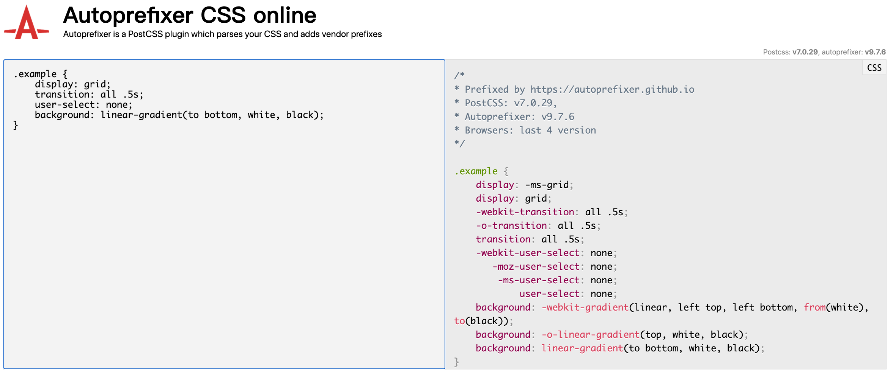

## 【step-by-step】7. 通过 postcss 使用新一代的 CSS 语法

> 本篇文档的目的是希望前端同学能够以 `复制粘贴` 的方式，快速在 [webpack 工程](../examples/01-base) 中添加插件。因此，一些说明性质的知识将以`推荐阅读`的方式推荐给大家。

<!-- START doctoc generated TOC please keep comment here to allow auto update -->
<!-- DON'T EDIT THIS SECTION, INSTEAD RE-RUN doctoc TO UPDATE -->

- [TL;DR](#tldr)
- [7.1 步骤](#71-%E6%AD%A5%E9%AA%A4)
- [7.2 具体流程](#72-%E5%85%B7%E4%BD%93%E6%B5%81%E7%A8%8B)
- [7.2.1 安装 postcss-loader](#721-%E5%AE%89%E8%A3%85-postcss-loader)
- [7.2.2 创建 `.postcssrc.js` 文件](#722-%E5%88%9B%E5%BB%BA-postcssrcjs-%E6%96%87%E4%BB%B6)
- [7.2.3 调整 `webpack.base.js`](#723-%E8%B0%83%E6%95%B4-webpackbasejs)
  - [7.2.4 调整 `webpack.prod.js`](#724-%E8%B0%83%E6%95%B4-webpackprodjs)
- [7.3 测试](#73-%E6%B5%8B%E8%AF%95)
  - [7.3.1 调整项目](#731-%E8%B0%83%E6%95%B4%E9%A1%B9%E7%9B%AE)
  - [7.3.2 测试打包](#732-%E6%B5%8B%E8%AF%95%E6%89%93%E5%8C%85)
- [7.4 示例工程](#74-%E7%A4%BA%E4%BE%8B%E5%B7%A5%E7%A8%8B)
- [7.5 总结](#75-%E6%80%BB%E7%BB%93)

<!-- END doctoc generated TOC please keep comment here to allow auto update -->

### TL;DR


[postcss](https://www.postcss.com.cn/) 是一个利用 JavaScript 的强大编程能力对 **CSS 代码**进行转换的工具。它负责把 CSS 代码解析成抽象语法树结构（Abstract Syntax Tree，AST），再交由插件来进行处理。插件基于 CSS 代码的 AST 所能进行的操作是多种多样的，比如可以支持变量和混入（mixin），增加浏览器相关的声明前缀，或是把使用将来的 CSS 规范的样式规则转译（transpile）成当前的 CSS 规范支持的格式。从这个角度来说，PostCSS 的强大之处在于其不断发展的插件体系。目前 PostCSS 已经有 200 多个功能各异的插件。开发人员也可以根据项目的需要，开发出自己的 PostCSS 插件。

- postcss 能够自动为css 规则添加**前缀** ( [autoprefixer 插件](https://github.com/postcss/autoprefixer) )。
- postcss 能够将**最新**的 css 语法转换成大部分版本的浏览器都能理解的语法( [postcss-preset-env 插件](https://github.com/csstools/postcss-preset-env) )。
- postcss 能够使用 `stylelint` 强化一致性约束避免样式表中的错误( [stylelint](https://stylelint.io/user-guide/usage/postcss-plugin) )。

#### Autoprefixer

[Autoprefixer]((https://github.com/postcss/autoprefixer)) 是一款自动管理浏览器前缀的插件，它可以解析CSS文件并且添加浏览器前缀到CSS内容里，使用 [Can I Use](https://www.caniuse.com/) 的数据来决定哪些前缀是需要的。在 [如何处理CSS3属性前缀](https://www.w3cplus.com/css3/autoprefixer-css-vender-prefixes.html) 文章中，作者详细介绍了为什么要用浏览器前缀。

把Autoprefixe添加到资源构建工具（例如Webpack）后，可以完全忘记有关CSS前缀的东西，只需按照最新的W3C规范来正常书写CSS即可。如果项目需要支持旧版浏览器，可修改browsers参数设置

> Autoprefixer将使用基于当前浏览器支持的特性和属性数据去为你添加前缀。你可以尝试下Autoprefixer的demo： [Autoprefixer CSS online](http://autoprefixer.github.io/)



### 7.1 步骤

根据 [postcss-loader](https://www.npmjs.com/package/postcss-loader) 文档中的示例，我们在 [webpack 工程 04](../examples/04-add-eslint) 中添加 `postcss-loader` 的步骤如下：

- 安装 postcss-loader
- 创建 `.postcssrc` 文件
- 调整 `webpack` 的配置

示例工程：[05-add-postcss](../examples/05-add-postcss)

### 7.2 具体流程

### 7.2.1 安装 postcss-loader

同样的，我们在项目中直接添加 [postcss-loader](https://www.npmjs.com/package/postcss-loader) 来使用`postcss`的功能。 具体配置可参考： [postcss-loader](https://www.npmjs.com/package/postcss-loader)

```bash
yarn add postcss-loader -D
```

安装 `postcss` 相关的 `plugins`

```bash
yarn add postcss-load-config postcss-preset-env postcss-import -D
```

- postcss-load-config： 允许我们在工程中，使用更多种类的配置文件。
- postcss-preset-env： 允许我们在工程中，使用 **新一代**的 css 语法 ，根据 `browserslist` 进行转译。
- postcss-import：通过内联内容来转换@import规则。

### 7.2.2 创建 `.postcssrc.js` 文件

在工程的根目录下，创建 `.postcssrc.js` 文件

```javascript
// .postcssrc.js
module.exports = {
  plugins: [
    require('postcss-import'), // 需要放到最上面
    // require('autoprefixer'), // 自动添加浏览器前缀（已经包含在 postcss-preset-env 中）
    require('postcss-preset-env')() // 使用下一代css语法
  ]
}
```

### 7.2.3 调整 `webpack.base.js`

根据 [postcss-loader](https://www.npmjs.com/package/postcss-loader) 文档中的示例说明，我们在 `webpack.base.js` 中，添加 `postcss-loader`

在 [build/webpack.base.js](../examples/05-add-postcss/build/webpack.base.js) 中， 我们把 `postcss-loader` 添加到 .css 文件的loader列表中。

```javascript
// webpack.base.js
module.exports = {
  module: {
    rules: [
      {
        test: /\.css$/,
        use: [
          'style-loader',
          // 在此添加 postcss-loader 的配置
          {
            loader: 'css-loader',
            options: {
              importLoaders: 1
            }
          },
          {
            loader: 'postcss-loader'
          }
          // END 在此添加 postcss-loader 的配置
        ]
      }
    ]
  }
}
```

#### 7.2.4 调整 `webpack.prod.js`

由于 `webpack.prod.js` 中 css 的配置与 base 中的不一样，所以需要分别配置。

[build/webpack.prod.js](../examples/05-add-postcss/build/webpack.prod.js)

```javascript
const webpackConfig = merge(base, {
  module: {
    rules: [
      {
        test: /\.css$/i,
        use: [
          {
            loader: MiniCssExtractPlugin.loader,
            options: {
              esModule: true
            }
          },
          // 在此添加 postcss-loader 的配置
          {
            loader: 'css-loader',
            options: {
              importLoaders: 1
            }
          },
          {
            loader: 'postcss-loader'
          }
          // END 在此添加 postcss-loader 的配置
        ]
      }
    ]
  }
})
```

### 7.3 测试

#### 7.3.1 调整项目

我们在项目中添加 **最新的 CSS 语法**后，查看 `postcss-loader` 是否能够帮助我们自动转译这些新的 CSS 语法。

在 `style.css` 文件中添加最新的 CSS 语法，并在 `index.js`中引用这个 css 文件。

[src/assets/style.css](../examples/05-add-postcss/src/assets/style.css)

```css
::placeholder {
  color: gray;
}

body {
  background-color: red;
}

.example {
  display: flex;
  position: relative;
  transform: translate(10, 10);
}
```

[src/index.js](../examples/05-add-postcss/src/index.js)

```javascript
import './assets/style.css'

document.body.innerHTML = `<div class="example">hello world</div>`
```

#### 7.3.2 测试打包

运行打包命令

```bash
npm run build
```

查看 `dist/app.css`，原来的 css 文件已经被转译。

```css
::-webkit-input-placeholder {
  color: gray;
}

::-moz-placeholder {
  color: gray;
}

:-ms-input-placeholder {
  color: gray;
}

::-ms-input-placeholder {
  color: gray;
}

::placeholder {
  color: gray;
}

body {
  background-color: red;
  color: white;
}

.example {
  display: -webkit-box;
  display: -ms-flexbox;
  display: flex;
  position: relative;
  -webkit-transform: translate(10, 10);
  transform: translate(10, 10);
}

/*# sourceMappingURL=app.css.map*/
```

done!

### 7.4 示例工程

示例工程：[05-add-postcss](../examples/05-add-postcss)

```
|-- examples
    |-- .babelrc
    |-- .editorconfig
    |-- .eslintrc.js
    |-- .postcssrc.js // postcss 配置文件
    |-- .prettierrc.js
    |-- index.html
    |-- package.json
    |-- build
    |   |-- webpack.base.js
    |   |-- webpack.dev.js
    |   |-- webpack.prod.js
    |-- src
        |-- index.js
        |-- assets
            |-- style.css
```

### 7.5 总结

添加 `postcss-loader` 的步骤

- 安装 `postcss-loader`
- 创建 `.postcssrc` 文件
- 调整 `webpack` 的配置

### 推荐阅读

- [使用 PostCSS 进行 CSS 处理](https://developer.ibm.com/zh/articles/1604-postcss-css/)
- [PostCSS真的太好用了！](https://zhuanlan.zhihu.com/p/61344763)
- [如何处理CSS3属性前缀](https://www.w3cplus.com/css3/autoprefixer-css-vender-prefixes.html)
