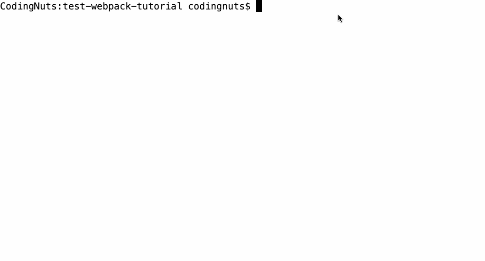
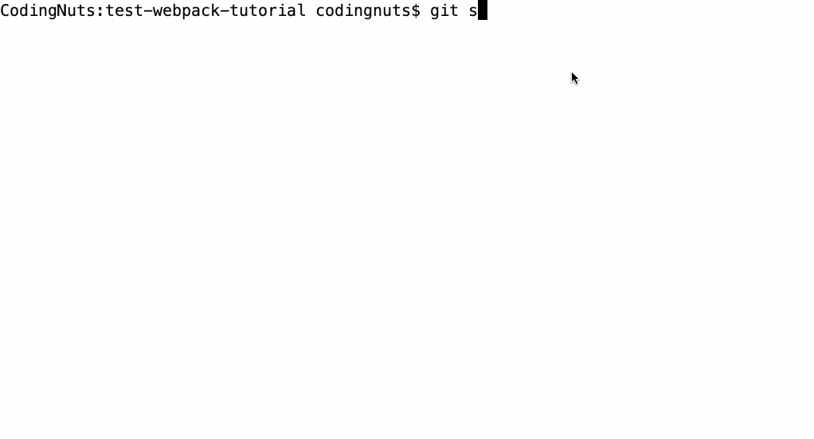

## 【step-by-step】9. 使用 husky 和 lint-staged 来调用 Git Hook (Pre-commit)

> 本篇文档的目的是希望前端同学能够以 `复制粘贴` 的方式，快速在 [webpack 工程](../examples/01-base) 中添加插件。因此，一些说明性质的知识将以`推荐阅读`的方式推荐给大家。

<!-- START doctoc generated TOC please keep comment here to allow auto update -->
<!-- DON'T EDIT THIS SECTION, INSTEAD RE-RUN doctoc TO UPDATE -->


- [TL;DR](#tldr)
- [9.1 添加的步骤](#91-%E6%B7%BB%E5%8A%A0%E7%9A%84%E6%AD%A5%E9%AA%A4)
- [9.2 具体流程](#92-%E5%85%B7%E4%BD%93%E6%B5%81%E7%A8%8B)
  - [9.2.1 安装依赖](#921-%E5%AE%89%E8%A3%85%E4%BE%9D%E8%B5%96)
  - [9.2.2 在 package 中添加配置](#922-%E5%9C%A8-package-%E4%B8%AD%E6%B7%BB%E5%8A%A0%E9%85%8D%E7%BD%AE)
  - [9.2.3 添加 ignore 文件](#923-%E6%B7%BB%E5%8A%A0-ignore-%E6%96%87%E4%BB%B6)
- [9.3 验证](#93-%E9%AA%8C%E8%AF%81)
  - [9.3.1 验证 prettier](#931-%E9%AA%8C%E8%AF%81-prettier)
    - [修改文件](#%E4%BF%AE%E6%94%B9%E6%96%87%E4%BB%B6)
    - [提交代码](#%E6%8F%90%E4%BA%A4%E4%BB%A3%E7%A0%81)
  - [9.3.2 验证 eslint](#932-%E9%AA%8C%E8%AF%81-eslint)
    - [修改文件](#%E4%BF%AE%E6%94%B9%E6%96%87%E4%BB%B6-1)
    - [提交 git 进行验证](#%E6%8F%90%E4%BA%A4-git-%E8%BF%9B%E8%A1%8C%E9%AA%8C%E8%AF%81)
- [9.4 示例工程](#94-%E7%A4%BA%E4%BE%8B%E5%B7%A5%E7%A8%8B)
- [9.5 总结](#95-%E6%80%BB%E7%BB%93)
- [推荐阅读](#%E6%8E%A8%E8%8D%90%E9%98%85%E8%AF%BB)

<!-- END doctoc generated TOC please keep comment here to allow auto update -->

### TL;DR

为了避免 `一千个程序员，就有一千种代码风格` ！我们期待在提交代码时，`Git Hook` 自动调用 `prettier` 统一代码风格，然后调用 `eslint` 和 `stylelint` 审查代码语法。同时，我们也期待 `eslint` 这类工具**只**审查本地修改过的文件，而不是所有文件，以此来提升执行效率。

我们借助下面两个工具来达成目标：

- [husky](https://github.com/typicode/husky#readme) ： `husky` 是一个Git Hook工具（对！就是二哈的英文名）。 Git 能在特定的重要动作发生时触发 `Husky` 中的自定义脚本。在本工程中，主要是 `pre-commit`，也就是在执行 git commit 之前，先执行一些自定义操作。可参考：[Git 钩子](https://www.git-scm.com/book/zh/v2/%E8%87%AA%E5%AE%9A%E4%B9%89-Git-Git-%E9%92%A9%E5%AD%90) 。
- [lint-staged](https://www.npmjs.com/package/lint-staged) ： `lint-staged` 可以让我们只对 **Git 缓冲区** 中的文件执行操作。


### 9.1 安装步骤

根据 [pretter.io](https://prettier.io/docs/en/precommit.html) 文档中的建议，以及 [husky](https://github.com/typicode/husky#readme) 和 [lint-staged](https://www.npmjs.com/package/lint-staged) 说明文档中的示例说明，我们在 [webpack工程06](../examples/06-add-stylelint) 中添加 `Git Hook` 的步骤如下所示：

- 安装依赖
- 在`package.json`中添加 `husky` 和 `lint-staged` 的配置
- 添加 `ignore` 文件

示例工程：[07-add-lint-staged](../examples/07-add-lint-staged)

### 9.2 具体流程

#### 9.2.1 安装依赖

运行命令安装 `husky` 和 `lint-staged`

```
yarn add husky lint-staged -D
```

安装完 `husky` 后，在 `根目录` 下查看 `.git/hooks` 文件夹下面的脚本：

例如 .git/hooks/pre-commit

```shell
#!/bin/sh
# husky

# Created by Husky v4.3.0 (https://github.com/typicode/husky#readme)
#   At: 9/14/2020, 3:31:42 PM
#   From: /Users/CodingNutsZac/Documents/founder/git/webpack-tutorial/node_modules/husky (https://github.com/typicode/husky#readme)

. "$(dirname "$0")/husky.sh"
```

从注释中可以看出，这个脚本是由 `husky` 生成的，由此证明 `husky` 安装成功。

#### 9.2.2 在 package 中添加配置

在 `package.json` 中添加 `husky` 和 `lint-staged` 的配置：

```json
{
  "husky": {
    "hooks": {
      "pre-commit": "lint-staged"
    }
  },
  "lint-staged": {
    "src/**/*.js": ["prettier --write", "eslint --cache --fix"],
    "src/**/*.css": ["prettier --write", "stylelint --cache --fix"]
  }
}
```

- `husky` 在 pre-commit 阶段（也就是 commit 之前）执行 lint-staged 命令。
- `lint-staged` 里面定义了需要对 Git 暂存区中的文件执行的任务。先优化暂存区中的 js 代码格式，再进行 eslint 检测。
- 如果在 `eslint` 执行阶段抛错了，则表示报错代码不符合 `eslint 规范`，进而导致 pre-commit 钩子抛错，最终导致整个 `commit 操作`失败。

> `lint-staged` 将把 `git缓冲区` 中文件的绝对路径作为参数传给命令行，这样我们就可以只操作本地修改的文件了。

#### 9.2.3 添加 ignore 文件

至此，我们就定义完 Git Hook 中的指令了。为了使整个工程更易于扩展，建议在工程中添加下面的 `ignore` 文件：

- [.eslintignore](../examples/07-add-lint-staged/.eslintignore) ： ESLint 的ignore文件。
- [.gitignore](../examples/07-add-lint-staged/.gitignore) ： Git 的ignore文件。
- [.prettierignore](../examples/07-add-lint-staged/.prettierignore) ： prettier 的ignore文件。

### 9.3 验证

#### 9.3.1 验证 prettier

我们故意弄乱代码风格后执行`git commit`，查看 `husky` 和 `lint-staged` 是否会调用 `prettier` 对代码格式化。

##### 修改文件

修改 `src/index.js` 以及 `src/assets/style.css`。如果在 `git commit` 时，`prettier` 修复了代码格式，证明 `husky` 和 `lint-staged` 添加成功。

[src/index.js](../examples/07-add-lint-staged/src/index.js) 中，有两处错误： 1. 两行代码之间有多个换行符；2. 段位的分号问题；

```
// 两行代码之间，添加多个换行。这是违背eslint规则的，理应报错。
import './assets/style.css';


document.body.innerHTML = `<div class="example">hello world, zac</div>`;
```

[src/assets/style.css](../examples/07-add-lint-staged/src/assets/style.css)中，有两处错误：1. 第8行的分号；2. 第9行到第12行的换行符。

```
::placeholder {
  color: #fff;
}

body {
  background-color: #000;
  color: white;
};


.example {
  display: flex;
  position: relative;
  transform: translate(10, 10);
}
```

##### 提交代码

控制台输出如下



如果，执行`git commit` 后，两个修改过的文件被格式化，证明 `husky` 和 `lint-staged` 安装成功。

#### 9.3.2 验证 eslint

我们故意在js代码当中添加错误的语法调用。如果在 `git commit` 的时候，eslint 提示报错信息，证明 `husky` 和 `lint-staged` 安装成功。

##### 修改文件

```js
// 两行代码之间，添加 `return`，eslint应该会报错。
import './assets/style.css'

return

document.body.innerHTML = `<div class="example">hello world, zac</div>`
```

##### 提交 git 进行验证

控制台展示如下：



looooool

### 9.4 示例工程

示例工程：[07-add-lint-staged](../examples/07-add-lint-staged)

```
|-- examples
    |-- .babelrc
    |-- .editorconfig
    |-- .eslintignore // eslint的ignore文件
    |-- .eslintrc.js
    |-- .gitignore // git的ignore文件
    |-- .postcssrc.js
    |-- .prettierignore // prettier的ignore文件
    |-- .prettierrc.js
    |-- .stylelintrc
    |-- index.html
    |-- package.json
    |-- build
    |   |-- webpack.base.js
    |   |-- webpack.dev.js
    |   |-- webpack.prod.js
    |-- src
        |-- index.js
        |-- assets
        |   |-- style.css
        |-- js
            |-- utils.js
```

### 9.5 总结

添加 `husky` 和 `lint-stage` 的步骤：

- 安装依赖
- 在`package.json`中添加 `husky` 和 `lint-staged` 的配置
- 添加 `ignore` 文件

### 推荐阅读

- prettier.io - Precommit-Hook： <https://prettier.io/docs/en/precommit.html>
- lint-staged： <https://www.npmjs.com/package/lint-staged>
- lint-staged 使用教程： <https://www.cnblogs.com/jiaoshou/p/12250278.html>
- Git 钩子： <https://www.git-scm.com/book/zh/v2/%E8%87%AA%E5%AE%9A%E4%B9%89-Git-Git-%E9%92%A9%E5%AD%90>
