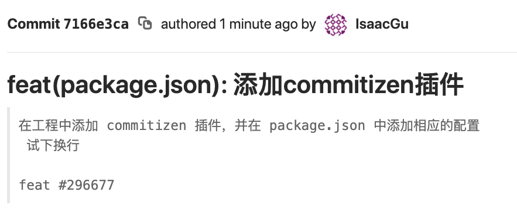

## 【step-by-step】10. 使用 commitizen 规范 Git 日志格式

> 本篇文档的目的是希望前端同学能够以 `复制粘贴` 的方式，快速在 [webpack 工程](../examples/01-base) 中添加插件。因此，一些说明性质的知识将以`推荐阅读`的方式推荐给大家。

<!-- START doctoc generated TOC please keep comment here to allow auto update -->
<!-- DON'T EDIT THIS SECTION, INSTEAD RE-RUN doctoc TO UPDATE -->


- [TL;DR](#tldr)
- [10.1 期待的日志格式](#101-%E6%9C%9F%E5%BE%85%E7%9A%84%E6%97%A5%E5%BF%97%E6%A0%BC%E5%BC%8F)
- [10.2 使用 commitizen 规范日志格式](#102-%E4%BD%BF%E7%94%A8-commitizen-%E8%A7%84%E8%8C%83%E6%97%A5%E5%BF%97%E6%A0%BC%E5%BC%8F)
- [10.3 添加步骤](#103-%E6%B7%BB%E5%8A%A0%E6%AD%A5%E9%AA%A4)
  - [10.3.1 安装依赖](#1031-%E5%AE%89%E8%A3%85%E4%BE%9D%E8%B5%96)
  - [10.3.2 调整 package.json 文件](#1032-%E8%B0%83%E6%95%B4-packagejson-%E6%96%87%E4%BB%B6)
- [10.4 测试](#104-%E6%B5%8B%E8%AF%95)
- [10.5 总结](#105-%E6%80%BB%E7%BB%93)
- [10.6 示例工程](#106-%E7%A4%BA%E4%BE%8B%E5%B7%A5%E7%A8%8B)
- [推荐](#%E6%8E%A8%E8%8D%90)

<!-- END doctoc generated TOC please keep comment here to allow auto update -->

### TL;DR

在项目开发中，我们经常能看到：

- 一连串 `一模一样` 的 commit 日志；
- 无法分辨`提交意图`的 commit 信息；
- commit 信息与更变代码之间`毫无关联`；

这些习惯会导致代码回滚、`issue` 追溯变得十分困难，让日志信息变得毫无意义。理想的 commit 信息应该是能较好的解决如上问题的。

- 发生问题时快速让 PM 识别问题代码并回滚。
- commit 和 代码之间建立联系，并和相关的 `issue` 予以关联。

因此，我们期待的流程是：

- [ ] [commitizen](./10-add-commitizen.md) ： 生成 commit message 的约定模板。
- [ ] [commitlint](./11-add-commitlint.md)： 检查 commit message 是否符合提交格式。
- [ ] [standard-version](./12-add-changelog.md) ： 每次发版的时候，生成 `changelog.md`，方便查看`发版信息`以及`工单与代码的对应关系`。

当前比较推荐的日志格式是 [Angular Git Commit Guidelines](https://github.com/angular/angular.js/blob/master/DEVELOPERS.md#-git-commit-guidelines) ，我们后面所使用的插件也是基于 `angular` 日志格式的。

接下来将介绍如何在系统安装 `commitizen`，并使用它生成 Git 提交日志。

### 10.1 期待的日志格式

`Augular` 推荐的日志格式：

```
<type>(<scope>): <subject>
<BLANK LINE>
<body>
<BLANK LINE>
<footer>
```

- `type`：本次 commit 的类型，诸如 feat、fix、docs 等。
- `scope`：本次 commit 涉及的范围，例如组件、文件等。
- `subject`：日志的标题。
- `body`：详细说明本次 commit 的内容，动机等，如需换行使用 `\n` 。
- `footer`：描述与之关联的 issue 或 change
  - 不兼容变动：如果当前代码与上一个版本不兼容，则 Footer 部分以 BREAKING CHANGE 开头，后面是对变动的描述、以及变动理由和迁移方法。
  - 关闭 Issue：如果当前 commit 针对某个 issue，那么可以在 Footer 部分关闭这个 issue。例如： `closes #123` 。

例如：

```markdown
feat(\$browser): onUrlChange event (popstate/hashchange/polling)

Added new event to \$browser:

- forward popstate event if available
- forward hashchange event if popstate not available
- do polling when neither popstate nor hashchange available

Breaks \$browser.onHashChange, which was removed (use onUrlChange instead)
```

```markdown
fix(\$compile): couple of unit tests for IE9

Older IEs serialize html uppercased, but IE9 does not...
Would be better to expect case insensitive, unfortunately jasmine does
not allow to user regexps for throw expectations.

Closes #392
Breaks foo.bar api, foo.baz should be used instead
```

```markdown
feat(directive): ng:disabled, ng:checked, ng:multiple, ng:readonly, ng:selected

New directives for proper binding these attributes in older browsers (IE).
Added coresponding description, live examples and e2e tests.

Closes #351
```

更多的例子：[Git Commit Message Conventions](https://docs.google.com/document/d/1QrDFcIiPjSLDn3EL15IJygNPiHORgU1_OOAqWjiDU5Y/edit#heading=h.8sw072iehlhg)

### 10.2 使用 commitizen 规范日志格式

[commitzen](https://github.com/commitizen/cz-cli) 是格式化 commit message 的工具，它以`问询`的方式获取所需的信息。

### 10.3 添加步骤

根据 [commitizen 文档](https://github.com/commitizen/cz-cli) 中的说明，我们在 [webpack 项目 07](../examples/07-add-lint-staged) 中添加 `commitizen` ：

- 安装依赖
- 调整 package.json 文件

示例工程：[08-add-commitizen](../examples/08-add-commitizen)

#### 10.3.1 安装依赖

安装格式化工具 commitizen：

```bash
yarn add commitizen -D
```

我们需要按照一定的标准来规范日志的格式，也就是需要遵照 `约定格式` 的 `适配器 `，这样 `commitizen` 才能按照固定格式进行交互式提问。

```bash
npx commitizen init cz-conventional-changelog --yarn --dev --exact
```

##### 注意

运行上面的命令后，脚本会在 `package.json` 中添加 `config.commitizen` 属性。此时，我们需要调整 `path` 属性，避免在windows下运行 `commitizen` 脚本时报错！

```
"config": {
    "commitizen": {
-     "path": "./node_modules/cz-conventional-changelog"
+     "path": "cz-conventional-changelog"
    }
  }
``` 

#### 10.3.2 调整 package.json 文件

在 script 中添加 `ct` 命令。

```json
{
  "script": {
    "ct": "git add . && git-cz"
  }
}
```

### 10.4 测试

提交代码进行验证，由于 git add 命令已经添加到 `ct` 中了，因此直接在 terminal 中运行 `npm run ct` 来提交代码。


在 gitlab 上看结果：



### 10.5 总结

添加 `commitizen` 的步骤：

- 安装依赖
- 调整 package.json 文件

### 10.6 示例工程

示例工程：[08-add-commitizen](../examples/08-add-commitizen)

```
|-- examples
    |-- .babelrc
    |-- .editorconfig
    |-- .eslintignore
    |-- .eslintrc.js
    |-- .gitignore
    |-- .postcssrc.js
    |-- .prettierignore
    |-- .prettierrc.js
    |-- .stylelintrc
    |-- index.html
    |-- package.json
    |-- build
    |   |-- webpack.base.js
    |   |-- webpack.dev.js
    |   |-- webpack.prod.js
    |-- src
        |-- index.js
        |-- assets
        |   |-- style.css
        |-- js
            |-- utils.js
```

### 推荐

- [用工具思路来规范化 git commit message](https://github.com/pigcan/blog/issues/15)
- [阮一峰：Commit message 和 Change log 编写指南](http://www.ruanyifeng.com/blog/2016/01/commit_message_change_log.html)
