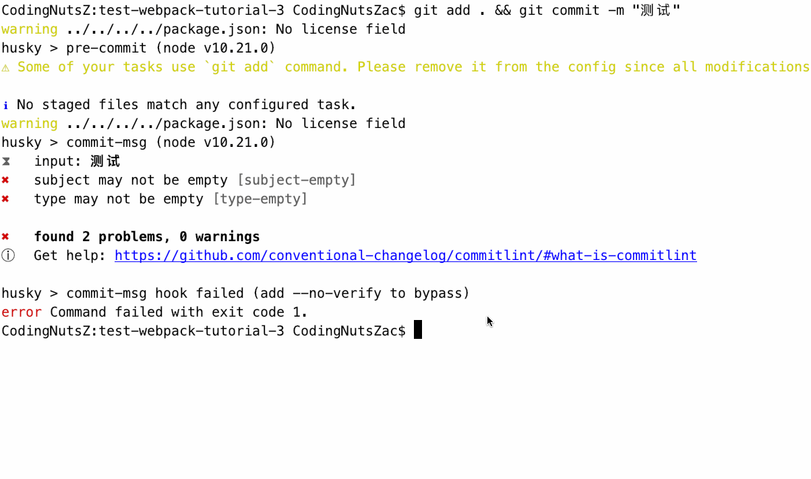

## 【step-by-step】11. 使用 commitlint 审查 Git 日志规范

> 本篇文档的目的是希望前端同学能够以 `复制粘贴` 的方式，快速在 [webpack 工程](../examples/01-base) 中添加插件。因此，一些说明性质的知识将以`推荐阅读`的方式推荐给大家。

<!-- START doctoc generated TOC please keep comment here to allow auto update -->
<!-- DON'T EDIT THIS SECTION, INSTEAD RE-RUN doctoc TO UPDATE -->


- [TL;DR](#tldr)
- [11.1 添加的步骤](#111-%E6%B7%BB%E5%8A%A0%E7%9A%84%E6%AD%A5%E9%AA%A4)
- [11.2 具体流程](#112-%E5%85%B7%E4%BD%93%E6%B5%81%E7%A8%8B)
  - [11.2.1 安装依赖](#1121-%E5%AE%89%E8%A3%85%E4%BE%9D%E8%B5%96)
  - [11.2.2 生成配置文件](#1122-%E7%94%9F%E6%88%90%E9%85%8D%E7%BD%AE%E6%96%87%E4%BB%B6)
  - [11.2.3 调整 `package.json`](#1123-%E8%B0%83%E6%95%B4-packagejson)
- [11.3 测试](#113-%E6%B5%8B%E8%AF%95)
- [11.4 通过 commitizen 来提交 git](#114-%E9%80%9A%E8%BF%87-commitizen-%E6%9D%A5%E6%8F%90%E4%BA%A4-git)
- [11.5 示例工程](#115-%E7%A4%BA%E4%BE%8B%E5%B7%A5%E7%A8%8B)
- [11.6 总结](#116-%E6%80%BB%E7%BB%93)
- [推荐](#%E6%8E%A8%E8%8D%90)

<!-- END doctoc generated TOC please keep comment here to allow auto update -->

我们期待能有一套自动化工具，帮助我们自动调整代码风格，自动审查代码语法。使我们能够把更多的精力投放到业务开发中，而不是千奇百怪的代码风格上。

因此，我们在工程中添加几个工具：

- [x] .editorconfig ： 让IDE遵循同样的编写规则。
- [x] prettier ： 代码格式化工具。
- [x] eslint ： 审查 js 语法。
- [x] stylelint ： 审查 css 语法。
- [ ] commitlint ： 审查 git commit 信息格式。

### TL;DR

对于 Git 日志，我们期待的流程是：

- [x] [commitizen](./10-add-commitizen.md) ： 生成 commit message 的约定模板。
- [ ] [commitlint](./11-add-commitlint.md)： 检查 commit message 是否符合提交格式。
- [ ] [standard-version](./12-add-changelog.md) ： 每次发版的时候，生成 `changelog.md`，方便查看`发版信息`以及`工单与代码的对应关系`。

当前比较推荐的日志格式是 [Angular Git Commit Guidelines](https://github.com/angular/angular.js/blob/master/DEVELOPERS.md#-git-commit-guidelines) ，我们后面所使用的插件也是基于 `angular` 日志格式的。

接下来将介绍如何在系统安装 `commitlint`，并使用它审查日志格式。

### 11.1 添加的步骤

- 安装依赖
- 生成配置
- 调整 `package.json`

### 11.2 具体流程

根据 [github:commitlint](https://github.com/conventional-changelog/commitlint) 中的示例，我们在 [webpack 工程 08](../examples/08-add-commitizen) 中通过以下的流程来安装 `commitlint`。

- 安装依赖
- 配置文件
- 调整 package.json

示例工程： [09-add-changelog](../examples/09-add-changelog) (与下一个例子放一个 demo 里了)

#### 11.2.1 安装依赖

安装 `commitlint` cli 以及配置的 adapter。

```bash
yarn add @commitlint/config-angular @commitlint/cli -D
```

#### 11.2.2 生成配置文件

用以下命令生成配置文件 `commitlint.config.js`

```bash
echo "module.exports = {extends: ['@commitlint/config-angular']}" > commitlint.config.js
```

> 注意：请务必检查一下已生成的 `commitlint.config.js` 文件。在windows下，生成的 `commitlint.config.js` 文件可能会存在格式错误，例如在内容两端有双引号 (")。

#### 11.2.3 调整 `package.json`

在 `package.json` 中添加 `husky` 的 hook：

```json
{
  "husky": {
    "hooks": {
      "commit-msg": "commitlint -E HUSKY_GIT_PARAMS"
    }
  }
}
```

### 11.3 测试

运行命令来验证 `commitlint` 是否安装成功。

```bash
git add . && git commit -m "测试"

# 在 windows 下，请分开运行
git add .
git commit -m "测试"
```

在 terminal 中会出现以下错误，证明安装成功。

```
> git add . && git commit -m "测试"
warning ../../../../package.json: No license field
husky > pre-commit (node v10.21.0)
⚠ Some of your tasks use `git add` command. Please remove it from the config since all modifications made by tasks will be automatically added to the git commit index.

ℹ No staged files match any configured task.
warning ../../../../package.json: No license field
husky > commit-msg (node v10.21.0)
⧗   input: 测试
✖   subject may not be empty [subject-empty]
✖   type may not be empty [type-empty]

✖   found 2 problems, 0 warnings
ⓘ   Get help: https://github.com/conventional-changelog/commitlint/#what-is-commitlint

husky > commit-msg hook failed (add --no-verify to bypass)
error Command failed with exit code 1.
```

### 11.4 通过 commitizen 来提交 git

如下：



### 11.5 示例工程

示例工程： [09-add-changelog](../examples/09-add-changelog) (与下一个例子放一个 demo 里了)

```
|-- examples
    |-- .babelrc
    |-- .editorconfig
    |-- .eslintignore
    |-- .eslintrc.js
    |-- .gitignore
    |-- .postcssrc.js
    |-- .prettierignore
    |-- .prettierrc.js
    |-- .stylelintrc
    |-- commitlint.config.js // 新添加的 commitlint 的配置
    |-- index.html
    |-- package.json
    |-- build
    |   |-- webpack.base.js
    |   |-- webpack.dev.js
    |   |-- webpack.prod.js
    |-- src
        |-- index.js
        |-- assets
        |   |-- style.css
        |-- js
            |-- utils.js
```

### 11.6 总结

添加 commitlint 的步骤

- 安装依赖
- 生成配置
- 调整 `package.json`

### 推荐

- [用工具思路来规范化 git commit message](https://github.com/pigcan/blog/issues/15)
